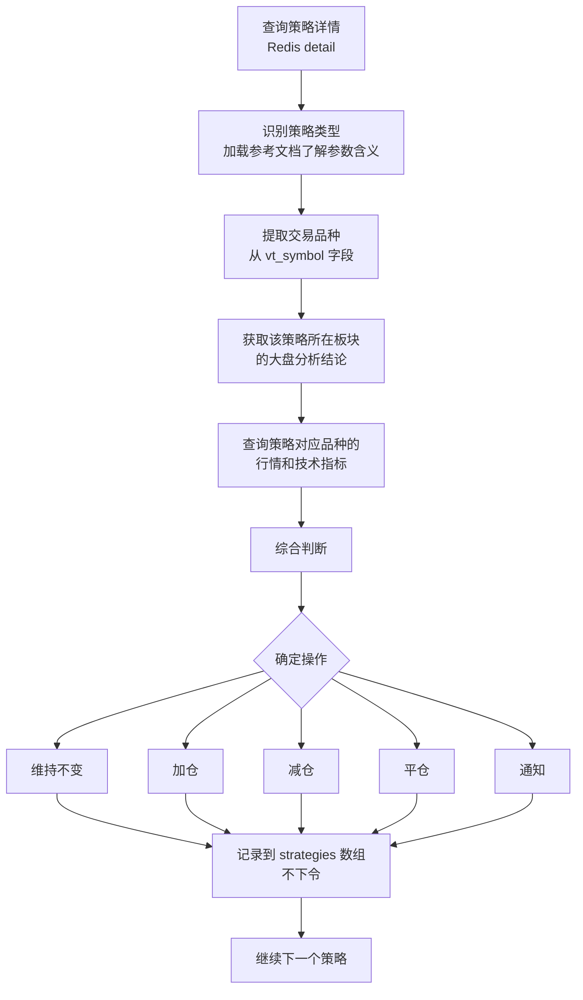

# vnpy整体持仓分析与风控模块

## 模块定位

本模块是 `tiger-stock-strategy-analysis` 技能的核心模块，负责对指定用户的**量化交易账户整体状态**进行综合分析，包括：

- 账户整体风险评估
- 各策略持仓盈亏分析
- 结合大盘与板块走势，判断是否存在重大机会或风险
- 必要时发送控制命令进行调整

***

## 前置依赖

在执行本模块前，AI 必须先完成以下前置步骤：

| 前置条件       | 说明                                                                  |
| ---------- | ------------------------------------------------------------------- |
| 明确用户名      | 必须知道目标用户的 `userid`，否则无法查询 Redis                                     |
| 明确所在市场     | 必须知道目标用户的交易市场类型，否则无法分析大盘                                            |
| Redis 查询工具 | 使用 [redis-info.md](../redis-info.md) 查询账户和策略数据                      |
| 大盘与板块分析    | 先执行 [大盘与板块和资金流向分析](../大盘与板块和资金流向分析/00_index.md) 获取市场大盘分析结论,有缓存就读取缓存 |
| 命令发送工具     | 使用 [vnpy-command-tool.md](../vnpy-command-tool.md) 发送策略控制命令         |

***

## 执行原则（全程遵守）

1. **低风险不干预** — 策略运行正常且风险评估为低时，仅记录分析结果，不发送任何控制命令
2. **先分析后执行** — 先完成所有策略的分析和决策，生成完整方案后再统一执行命令，不在遍历过程中逐一下令
3. **最小干预** — 能用 `set-target-pos` 调整的，不用 `close` 全平
4. **数据来源必注明** — 每个结论都要注明依据（Redis 数据 / 大盘分析结果 / 联网搜索），便于追溯

***

## 执行流程（AI 必须严格按此顺序执行）

### Step 0：查询账户和策略持仓信息

使用 `stock_redis_query.py` 获取指定用户的量化交易账户状态和每个策略的持仓信息及运行状态：

```bash
# 查指定账户信息和持仓
python scripts/stock_redis_query.py account <用户名>

# 查指定账户策略列表和概要 → 从此命令输出中提取所有策略名称
python scripts/stock_redis_query.py strategies <用户名>

# 对每个策略，查详情
python scripts/stock_redis_query.py detail <用户名> <策略名>
```

详细查询方式见 [redis-info.md](../redis-info.md)。

### Step 1：获取市场分析结论

根据用户交易的市场类型（美股、加密货币、中国期货、中国A股等），执行 [大盘与板块和资金流向分析](../大盘与板块和资金流向分析/00_index.md) 获取市场分析结论。
（如果有缓存，直接读取缓存，尽量不重新执行分析流程）

### Step 2：账户整体风险评估

分析账户整体状态，判断是否存在重大风险。以下量化阈值作为参考（AI 可根据实际情况调整）：

| 检查项     | 判断标准                                 | 风险等级  |
| ------- | ------------------------------------ | ----- |
| 大盘方向    | 大盘处于上涨/下跌/震荡趋势，是否出现趋势反转信号            | 高/中/低 |
| 板块轮动    | 持仓板块是否处于轮动末期或被资金抛弃，主线板块是否切换          | 高/中/低 |
| 板块强弱    | 板块近 5 日相对大盘跑输 > 3% 视为走弱，跑赢 > 3% 视为强势 | 高/中/低 |
| 潜在事件    | 未来一周是否有财报、FOMC、非农、地缘政治等可能引发波动的事件     | 高/中/低 |
| 总仓位占比   | > 80% 为高，50%-80% 为中，< 50% 为低         | 高/中/低 |
| 单一板块集中度 | 单一板块占比 > 60% 为高，30%-60% 为中，< 30% 为低  | 高/中/低 |
| 流动性风险   | 持仓品种日均成交量是否足够，IB 微盘股需警惕              | 高/中/低 |

### Step 3：账户整体机会分析

分析账户是否存在更好的操作方案和盈利机会：

| 检查项      | 判断标准                           |
| -------- | ------------------------------ |
| 资金利用率    | 仓位 < 50% 且有明确主线板块机会 → 可加仓      |
| 板块轮动机会   | 当前主线板块有对应的策略且仓位偏低 → 可加仓        |
| 新策略机会    | 是否有新的交易标的和机会可以开仓               |
| 盈利策略退出时机 | 策略盈利 > +5% 且大盘/板块出现回撤信号 → 考虑止盈 |

### Step 4：逐策略分析与决策

#### 4.1 获取策略列表

从 `stock_redis_query.py strategies <用户名>` 的输出中提取所有策略名称，得到一个策略名列表。

#### 4.2 逐策略分析流程

对列表中的 **每个策略**，按以下决策树执行：

1. **查询策略详情** — 用 `stock_redis_query.py detail <用户名> <策略名>` 获取策略完整数据
2. **识别策略类型并加载参考文档** — 从策略详情中获取 `策略类型` 字段（如 `智能马丁格尔策略`、`多信号权重评分趋势策略`），根据类型找到对应的策略文档（见文末 [策略类型的参考文档](#策略类型的参考文档)），了解该策略的参数含义和运行逻辑，便于准确判断策略当前是否处于正常状态
3. **提取交易品种** — 从策略详情中获取 `vt_symbol` 字段，该字段标识策略交易的标的（如 `9939.SMART` 表示盈透品种 `9939`, `NVDA.SMART` 表示美股 `NVDA`）。如果 `vt_symbol` 是纯数字格式（如 `9939.SMART`），优先从 [scripts/vt_symbol_info.json](../../scripts/vt_symbol_info.json) 中查找该 ConID 对应的股票名称；如果本地文件未覆盖，再通过 [SKILL.md](../../SKILL.md) 中的 `conid` 工具远程查询。确定真实股票名称后，再联网搜索品种行情、新闻和技术指标。
4. **获取该策略所在板块的大盘分析结论** — 从 Step 1 的结果中取对应板块的方向和风险等级
5. **查询策略对应品种的行情和技术指标** — 联网搜索该品种当前价格、技术面、新闻事件等



#### 4.3 综合判断规则

AI 根据以下维度综合判断每个策略的操作：

| 判断维度   | 数据来源        | 判断要点             |
| ------ | ----------- | ---------------- |
| 策略盈亏   | `detail` 输出 | 浮盈/浮亏比例，持仓天数     |
| 策略方向   | `detail` 输出 | 做多/做空，与大盘方向是否一致  |
| 品种行情   | 联网搜索 | 当前价格、技术指标、近 7 天新闻 |
| 板块方向   | Step 1 结论   | 该板块看多/看空/震荡      |
| 板块轮动阶段 | Step 1 结论   | AI链/半导体/金融/能源/防御 |
| 大盘风险等级 | Step 2 结论   | 低/中/高/极高         |
| 潜在事件   | Step 2 结论   | 近期是否有该板块的重大事件    |

#### 4.4 操作决策与触发条件

##### A. 宏观风险来时，统一降总风险

当出现流动性收紧、风险资产整体承压的宏观信号时，AI 应优先从账户整体角度降低总风险，而不是只看单个策略盈亏。

典型宏观风险信号包括：

- 美联储偏鹰、加息预期强化、实际加息落地
- 美债收益率快速上行，尤其是 10Y 明显突破关键区间
- DXY 快速走强，风险资产承压
- VIX 急升，市场进入避险模式
- CPI、非农、FOMC 等重大事件前后，波动显著放大

宏观风险下的统一动作规则：

| 风险情形 | 建议动作 | 命令 |
|---------|---------|------|
| 大盘风险等级 = 高 | 对高风险板块、高 beta 品种、已有浮盈策略优先减仓 | `set-target-pos` 降低仓位 |
| 大盘风险等级 = 极高 | 优先锁定盈利，显著降低总仓位，必要时平掉高风险策略 | `set-target-pos` / `close` |
| 重大事件临近（FOMC/CPI/财报） | 高杠杆策略、马丁类策略先降风险暴露 | `notice` / `set-target-pos` |

##### B. 板块轮动时，做结构性调整

当市场主线发生变化时，AI 应按板块强弱做结构性调整，而不是对所有策略一刀切。

典型板块轮动信号包括：

- 原主线板块持续跑输大盘
- 新主线板块获得持续资金流入
- 防御板块开始走强，说明风险偏好下降
- 持仓板块出现破位、放量下跌、利空事件共振

板块轮动下的结构性动作规则：

| 板块状态 | 建议动作 | 命令 |
|---------|---------|------|
| 持仓板块走弱，且近 5 日跑输大盘 > 3% | 优先减仓该板块相关策略 | `set-target-pos` |
| 持仓板块失去主线地位，且出现回撤信号 | 对浮盈策略先锁定利润，对浮亏策略评估止损 | `set-target-pos` / `close` |
| 新主线板块走强，账户有闲置资金 | 可对已有对应策略小幅加仓 | `set-target-pos` |
| 防御板块走强、成长板块普遍转弱 | 收缩成长和高波动策略仓位 | `notice` / `set-target-pos` |

##### C. 单策略操作判断

在宏观风险和板块轮动规则之下，再对单个策略做具体判断：

| 建议操作     | 典型触发条件                                               | 命令                    |
| -------- | ---------------------------------------------------- | --------------------- |
| **维持不变** | 策略浮盈/浮亏在 ±5% 以内，板块方向与大盘一致，无风险信号                      | 不发送命令                 |
| **通知**   | 板块出现风险信号但策略尚无浮亏，或潜在事件临近                              | `notice` 发送提醒         |
| **减仓**   | 板块走弱（近 5 日跑输大盘 > 3%），或大盘风险等级为高，或策略浮盈 > +5% 且板块出现回撤信号 | `set-target-pos` 降低仓位 |
| **加仓**   | 板块走强（近 5 日跑赢大盘 > 3%），大盘风险等级为低，策略方向与板块一致              | `set-target-pos` 增加仓位 |
| **平仓**   | 大盘风险等级为极高，或策略浮亏 > -15% 且板块持续走弱，或策略逻辑已失效              | `close` 全平            |

**例外处理**：

- 如果策略本身的止盈止损逻辑在正常运行，AI 不应干预，让策略自行处理
- 只有策略参数设置不合理（如止损线过宽）、或外部环境发生重大变化时，AI 才主动介入
- 当宏观风险和单策略信号冲突时，优先服从宏观风险控制

#### 4.5 中间结果记录格式

每个策略分析完成后，按以下格式暂存到内存中的 `strategies` 数组：

```python
{
    "策略名称": "MARTIN-AMD",
    "持仓量": 100,
    "持仓方向": "多",
    "盈亏": "+3.5%",
    "盈亏金额": "+35 USD",
    "板块": "半导体",
    "板块方向": "看多",
    "分析结论": "AMD 处于半导体板块，板块当前为 AI 链主线，走势健康。策略浮盈 3.5%，运行正常，建议维持。",
    "建议操作": "维持",
    "是否已发送命令": False,   # 所有策略先标记为 False
    "发送的命令": ""
}
```

> **关键规则**：在遍历过程中，**只记录、不下令**。所有策略分析完成后，统一进入 Step 5 决定是否执行命令。

***

### Step 5：输出分析结果

完成所有策略分析后，汇总输出。输出前执行以下检查：

1. **遍历 strategies 数组**：检查是否有策略的操作是"平仓"或"减仓/加仓"
2. **如果没有任何策略需要操作** → `"建议行动": "不干预"`
3. **如果有策略需要操作**：
   - 先发 `notice` 通知用户（汇总所有需要调整的策略及建议）
   - 等待用户确认后再执行具体命令
4. **批量执行**：用户确认后，逐个发送命令并记录结果

AI 必须按以下 JSON 格式返回结果：

```json
{
    "analysis_time": "2025-01-01 10:00:00 UTC",
    "userid": "tiger-code",
    "market_analysis": {
        "market_type": "美股",
        "大盘方向": "看多 / 看空 / 震荡",
        "风险等级": "低 / 中 / 高 / 极高",
        "来源": "大盘与板块和资金流向分析",
        "板块方向":[
            {
                "板块": "半导体",
                "方向": "看多 / 看空 / 震荡"
            },
            {
                "板块": "消费",
                "方向": "看多 / 看空 / 震荡"
            }
        ]
    },
    "account_overview": {
        "总账户价值": "XXX USD",
        "总持仓市值": "XXX USD",
        "总仓位占比": "XX%",
        "风险评估": "正常 / 关注 / 危险",
        "风险详情": "..."
    },
    "strategies": [
        {
            "策略名称": "MARTIN-AMD",
            "持仓量": 100,
            "持仓方向": "多 / 空",
            "盈亏": "0.03",
            "板块": "半导体",
            "分析结论": "...",
            "建议操作": "维持 / 加仓 / 减仓 / 平仓",
            "是否已发送命令": false,
            "发送的命令": ""
        }
    ],
    "overall_conclusion": "整体评估结论",
    "建议行动": "不干预 / 发送notice / 发送控制命令"
}
```

***

## 策略类型的参考文档

分析逐策略时，如需了解策略参数含义或运行逻辑，参考以下文档：

| 策略类型        | 文档                                                                                                |
| ----------- | ------------------------------------------------------------------------------------------------- |
| 智能马丁格尔网格策略  | [Martingale-Grid-Trading-Strategy/00-Router.md](../Martingale-Grid-Trading-Strategy/00-Router.md) |
| 多信号权重评分趋势策略 | [Multi\_Signal\_Treand\_Strategy.md](../Multi_Signal_Treand_Strategy.md)                          |
| 智能短期趋势策略    | [Short-term-CCI-Trend-Strategy.md](../Short-term-CCI-Trend-Strategy.md)                           |

**CTA 基类变量与参数参考**：

| 策略类型       | 文档                                                                     |
| ---------- | ---------------------------------------------------------------------- |
| CTA 趋势策略基类 | [Tiger-Grid-Template/00\_index.md](../Tiger-Grid-Template/00_index.md) |

