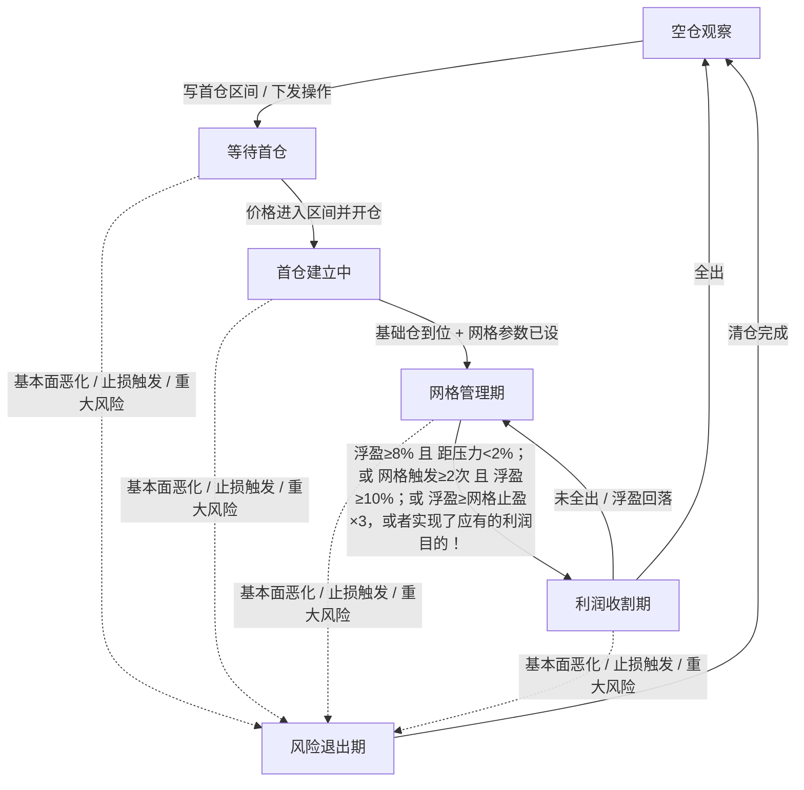

# 00 索引（AI 执行索引）

> 读法：§1 铁则 → §2 选意图参数 → §3 查阶段 → §4 查参数与通道 → §5 查机制；"怎么配/怎么切"跳 [`01-意图原型卡.md`](01-意图原型卡.md)。
> 键名：AI 报告与状态用**中文标准名**，MCP/建实例写入用**英文参数名**；映射见 01 §2 各卡参数表（意图相关），非卡参数速查见本索引 §4.4。参数名、默认值、通道以代码 `parameters_info` 为准。
> `README.md` 是给人读的总纲，AI 不读。

---

## 1 铁则与速查

### 1.1 九条铁则（违反即判"漂"）

1. 一仓一意图：同一时刻只承载一个意图。**持仓期换意图有条件**：持仓价/量与目标意图兼容（§1.3 三条件）且行情重大变化；不满足 → 必须先清仓再切。
2. 方向只在仓位=0 翻转；持仓期不做反向。
3. `是否允许止损` 恒 true；关闭 → 禁止开新仓。
4. 量公式：首仓量=资金基数×`建议首仓占比`÷价；每格量=资金基数×(1−首仓占比)÷`网格数量`÷价；**`网格数量`≤10**，网格关闭给 **0**（0 合法，每格量=0）；`首仓占比=1.0` ⇒ 没有网格（网格数为0）。
5. AI 报告可改**非参数类策略变量字段**（策略阶段/趋势枚举/趋势方向/操作/操作方向/预测置信度）；**所有策略参数（止盈止损/网格/首仓/区间/探针）只能由 vnpy_mcp 工具设置并读取验证闭环**，AI 报告里的参数建议只作变更对照与留痕，**以 vnpy_mcp 工具设置为准**。
6. `预测置信度` 是 AI 自评（被记录留痕）：**<0.6 时本轮结论不可信**，不得据此改参数、不得据此建仓。
7. 网格管理期网格加/减仓**照常执行**；清仓只有两条路径：**利润收割期**加`操作=立即`，立即清仓，人工/MCP 下发平仓操作，或按**风险退出期基线**清仓（卖底仓+网格减仓全开）。阶段只是描述，不构成闸门——"切到某阶段"不是清仓动作。
8. 只等不追：空仓期**不开仓 = 关 `是否允许网格主动开仓` 且不下发 `操作=立即`**（两个入口都关就是不动作）；要埋伏就是进入**等待首仓**，写 `首仓价格区间`（价格不到区间内就不开仓，区间上限=不追的价位）。`是否禁止追高` 在空仓期不生效，它只在持仓加仓时起作用。
9. 意图=整套参数，禁止半套；每次参数改动必须写 `参数修改理由`，无痕改动判漂。

### 1.2 三明治（意图三件套）

| 层 | 参数 | 角色 | 谁写 | 生命周期 |
|:--|:--|:--|:--|:--|
| 宪法 | `openclaw_main_approach`（策略核心思路） | 本实例只做什么、绝不做 | **人工 / 外部宏观分析智能体**，经 **MCP `cta_strategy_set_main_approach(策略名, 内容, reason)`**（覆盖式、需写 reason）；**本模块只读、不修改** | 长期有效；仓位=0 时由宏观层重写（新一手声明意图）；**持仓期换意图不重写它**（本手意图写在合同） |
| 合同 | `openclaw_user_remark`（备注） | **本手意图**（方向/依据/目标位/失效价/时限）+ **本次机会的考核条款**（成功/失败判据、到期处置）；开仓前写好，每轮自检与复盘以它为唯一标准 | **MCP `cta_strategy_send_user_remark(策略名, 内容)`**（自动加时间戳、整份覆盖）或 AI（仅非空时写入，同样覆盖）；**两种写入模式**：**切换意图 = 覆盖写入**（整份替换 ①~⑧）；**执行中 = 追加写入**（先读回现有备注 → 尾部追加 → 整份写回——工具只有覆盖，追加必须自己拼全文） | 持续保留到被覆盖；**清仓后不会自动清除**，换意图后旧合同由新合同整份覆盖 |
| 电报 | `openclaw_notice`（最新通知） | **短期禁令与预置剧本**（什么情况下不许做什么或者必须做什么） | MCP `cta_strategy_send_notice` | 新覆盖旧 |

**合同行文**（①~⑦ 切换时定、执行中锁定；⑧ 现状执行中每轮**追加更新**；重大事件追加事件行；全部价格/数量/日期用具体数值，禁形容词）：

```
① 方向=多｜仓位=未建仓（建后填 成本≈168.2，轮N / 09-18 14:30）
② 依据=枚举=看涨｜置信=0.78｜3月分位=0.62｜结构位=压力L2 172.5｜形态=压缩态3/4项（写当时证据值，供复盘判是否追尾声）
③ 目标=T1 185.0 / T2 192.0（趋势：≥3× 止损距离，盈亏比≥3:1）→ 到达切 利润收割期
④ 失效价=164.0（形态级；不得浅于止损触发价，否则止损先执行、本条作废）
⑤ 时限=09-30 或 20轮；到期未达 T1 → 重评去留（不自动割）
⑥ 考核：成功=达T1 或 浮盈≥止盈×3；失败=触失效价 或 到期浮盈<0 → 成功=利润收割期，失败=风险退出期
⑦ 前一手=09-05 于165.3止损，原因=…，教训=…
⑧ 现状=浮盈+3.2%｜已加2/5格｜距失效价2.1%
```

**三条规则**：

- **锁定**：持仓期内 ③④⑤ 锁定，改=必须写理由并留痕，否则判漂；
- **价格一致**：失效价不得浅于止损触发价、目标不得深于止盈触发价（浅/深的一边会先执行，另一边变死条款）；
- **不写**：参数值（止损幅度/网格间距属参数）、"绝不做"（属宪法）、行情评述（属报告）。

### 1.3 意图 × 阶段绑定

| 阶段 | 意图是否必须 | 可否换意图 |
|:--|:--|:--|
| 空仓观察 | 不要求 | **可以**（仓位=0） |
| 等待首仓 | **必须已设定**（主题+参数组合） | **可以**（仓位仍=0） |
| 首仓建立中 / 网格管理期 / 利润收割期 / 风险退出期 | 持仓锁定（一仓一意图） | **有条件**：兼容三条件 + 重大变化（§1.3）；不满足 → 先清仓再切 |

**持仓期换意图（条件窗口，除仓位=0 外的唯一入口）**：

- **兼容三条件**（对照目标意图的参数组合逐条核，须全部满足）：
  1. **方向一致**：持仓方向 = 目标意图方向（反向禁止，铁则 2）；
  2. **仓位量兼容**：当前持仓占比 ≤ 目标意图 `建议首仓占比` 上限（超限=仓位过重，先清仓或减至上限再切）；
  3. **持仓价兼容**：成本落在目标意图的入场纪律内（收波：成本在区间内；趋势/反转：成本不在追高侧 / 接刀侧）。
- **重大变化条件**：行情结构发生质变（结构位突破 / 反转确认 / 形态整体切换）且**连续 2 轮确认**；单根 K 线、小幅波动、"感觉更合适"不算。
- **执行 = 整套切换，按序（改的是合同，不是核心思路）**：① 前置：目标意图在核心思路声明的边界内（越界 → 上报宏观层调整核心思路，不得自行切换）；② **重写合同 ①~⑧**（`cta_strategy_send_user_remark`，本手意图=目标意图，写明"上一意图为何结束、本轮为何换"）；③ 经 MCP 换齐参数组合并逐条读回验证。**核心思路不动**——它是宏观层的长期宣言，本手意图写在合同里。任何一步缺痕 = 判漂。
- **连贯性纪律**：意图必须连贯——没有大的变化（§1.3 条件）不得换；复盘看**切换频率与理由充分性**，无重大变化的高频切换判漂。

### 1.4 AI 执行落地

AI 报告发给策略代码后，代码根据报告可改**非参数类策略变量字段**（6 个）：策略阶段、趋势枚举、趋势方向、操作、操作方向、预测置信度——写参数历史并持久化。

注意:备注/合同（`openclaw_user_remark`）：**切换意图时覆盖写入，执行中可追加写入**（§1.2 两种写入模式）。

其余**所有策略参数（止盈止损/网格/首仓/区间等等，用vnpy_mcp工具落地）**：AI 参数建议只做"本次报告 vs 策略上报参数"的**变化对照**与日志留痕；**参数只能由 vnpy_mcp 工具设置，设置后必须vnpy_mcp读取验证形成闭环，以 vnpy_mcp 设置为准**。

---

## 2 三意图参数速查

> 切换在**仓位=0** 时执行：改 `openclaw_user_remark` + 成套换下表参数。

| 意图 | 一句话 | 首仓占比 | 网格数量 | 网格间距 | 网格止盈 | 目标止损 | 止盈/盈利离场 | 触发模式 | 主动开仓 | 探针 | 失败模式 |
|:--|:--|:--:|:--:|:--:|:--:|:--:|:--:|:--:|:--:|:--|:--|
| **趋势** | 突破回踩确认后一笔进场，吃一段趋势（**盈亏比预期 ≥3:1、至 5:1**），不摊低成本 | 0.8~1.0 | **0**（网格关闭） | 0.03 | — | **0.02~0.05**（默认 0.03；超过=趋势形态预测错误，立砍） | **0.09~0.15**（=3~5× 止损，盈亏比 3:1~5:1，到达即离场；移动止盈关） | 两个加仓开关全 false（不摊低成本；主动开仓≠加仓） | 开（择机+首仓区间=埋伏） | EMA 交叉 + ATR | 震荡市反复打脸 / 做反趋势 / 买到趋势末尾 / 持仓期出现风险事件 |
| **反转**<br>（抓V反 / 阶段抄底 两种入场锚定） | 在大级别结构位反向接货，等均值修复离场，错了立刻砍 | 抓V反 0.5~0.7<br>抄底 0.2~0.3 | 抓V反 1~3<br>抄底 4~6 | 抓V反 0.05~0.10<br>抄底 0.03~0.05 | 抓V反 0.04~0.08<br>抄底 0.03~0.05 | 抓V反 0.06~0.12<br>抄底 0.09~0.15 | 抓V反 0.10~0.20<br>抄底 0.15~0.25<br>（+移动止盈；盈利离场=修复到结构**中轴**，分批走） | CCI | 开（择机） | 抓V反：RSI 背离+超卖<br>抄底：RSI 超卖+ATR | 判断错则单次重亏 / "偏离"变"新趋势" |
| **波动收波** | 区间震荡来回赚差价，不猜方向（**仅限区间内短期**；方向=跟随大环境：牛市只做多网格、熊市只做空网格），单边打穿即认输 | 0.15~0.25 | **8~10** | 0.02~0.03 | 0.015~0.025 | **≈0.6×间距×数量**（默认 0.15，0.10~0.18；锚定区间下沿，币宽区间到 0.25+） | 整仓 0.30~0.50（宽兜底）；**利润靠每格"加→减"闭环逐格兑现**（网格止盈+网格减仓），打穿走止损 | CCI 或纯价格 | 开（到价自动开首仓，否则网格无仓可管） | 全关（定时分析足够） | 单边打穿（**方向逆环境时逐格堆损**：牛市做空网格/熊市做多网格=最大毁损模式） |

**共同前提**

1. `是否允许止损` 恒 true（关闭则禁止开新仓）；
2. `止损幅度` 已与网格公式解耦：自由设定，只受 0.01~1.0 钳制，浅于/深于网格深度仅写日志；
3. `网格数量` 双重身份=每格量分母 + **本持仓周期最大加仓次数**；**方案上限 10**，网格关闭给 **0**（0 合法：每格量=0，代码零安全）；
4. 趋势意图：`网格数量=0` + 高 `首仓占比` 使网格物理失效；主动开仓=true 是首仓入口，不是加仓。
5. **趋势盈亏比预期 ≥3:1（至 5:1）**：止损 0.02~0.05（默认 0.03，即形态失效线，超过=形态预测错）；目标=止损距离的 3~5 倍（基准止盈 0.09~0.15，止损值变化时按 3~5 倍相应调整），合同 ③⑥ 按此写；ATR 止损/移动止盈在此止损制下都不成立（不先触发/未到目标就洗出），关闭。
6. **持仓符号必须与环境匹配**：波动收波/反转网格，**偏多环境只开多网格、偏空环境只开空网格**（方向由大级别/市场环境定）；方向做反（牛市做空网格/熊市做多网格）→ 单边一打穿**每一格都在堆损**，是最大毁损模式，止损只能限损不能避险。"不猜方向"仅指区间内短期，不豁免方向选择。

---

## 3 阶段表

| 阶段 | 持仓 | 网格 | 操作字段语义 | 阶段基线（AI 按此建议 + 人工/MCP 落地） | 是否允许减基础底仓 |
|:--|:--|:--|:--|:--|:--:|
| **空仓观察** | 无 | 未启动 | 仅存档 | 止盈/移动止盈/止损=开；**不开仓=主动开仓关+不下发立即，埋伏=写首仓区间**（铁则 8） | — |
| **等待首仓** | 无 | 未启动 | 立即=按方向立即开仓（现价须在首仓区间内）；择机=等 CCI（配 `是否允许网格主动开仓`）；禁止=不下单 | 止盈/移动止盈/止损=开 | — |
| **首仓建立中** | 有 | 未启动 | 立即=补仓到首仓占比；择机=等 CCI（配盈亏加仓开关）；禁止=不下单 | 止损=开；止盈/移动止盈=关（**例外：趋势=止盈全程保持开**，盈亏比由固定止盈执行） | 基线=关 |
| **网格管理期** | 有 | 已设/运行 | AI/人工只调参数（不下发立即单）；**网格加/减仓照常按参数执行** | 按参数实际值执行 | 基线=关 |
| **利润收割期** | 有 | 运行中 | 立即=人工/MCP 立即清仓；择机=按网格规则出货 | 按需设置 | 基线=可开（分批出货） |
| **风险退出期** | 递减 | **加停 / 减全开**（含卖基础底仓） | 立即=人工/MCP 立即清仓（直接下目标仓，不走网格）；择机=网格减仓+卖底仓分批出货 | 止盈/移动止盈/止损=开 + 卖底仓/网格减仓全开 | 基线=开 |

**流转条件**（虚线=任意**有持仓**状态都可因"基本面恶化/止损触发/重大风险"直入 风险退出期）：


> **阶段基线是执行约定**：AI 判断并输出阶段建议，参数由调用vnpy_mcp工具落地；。

---

## 4 参数与通道

### 4.1 三通道

| 通道 | 谁写 | 范围 | 写入口 |
|:--|:--|:--|:--|
| **MCP** | 外部智能体/人 | 35 个参数；未开放项返回 `blocked` | `cta_strategy_set_parameters` |
| **人工固化** | 人 | 其余参数 | 建实例 `setting` / UI 编辑 |
| **AI（仅变量字段）** | 策略内 AI | 6 个非参数字段：阶段/趋势枚举/趋势方向/操作/操作方向/置信度（备注见 §1.2） | AI 报告 |

> **AI 报告中的参数值不生效**（不写任何策略参数），只用于"与上一轮报告对比"的留痕；**参数以 vnpy_mcp 设置并读回验证为准**（§5.6）。

### 4.2 人工固定参数（AI 与 MCP 均不可改）

`init_load_days`、`use_1m_5m_15m_30m_60m`、`cci_martin_period`、`martin_k_time`、`target_delay_minute_max`、`volume_change_with_v`、`us_stock_trading_hours_only`、`loss_close_need_manual`、`close_cooldown_hours`、`x_script`/`y_script`/`x_window_count`/`y_window_count`、`enable_publish_status_redis`、`trade_radio`/`trade_fee`/`volume_min_unit`/`order_price_add`。

### 4.3 MCP 可改白名单

`openclaw_main_approach`、`openclaw_user_remark`、`openclaw_main_interval`、`enable_openclaw_analysis`、`enable_openclaw_confirm_target_pos`、`start_asset`、`first_part`、网格三数值与全部网格开关、全部止盈止损开关与幅度、ATR 开关/周期/倍数、`enable_cci_chance_only`、`base_direction`、全部探针参数、`openclaw_notice`（走 `send_notice`）。

### 4.4 参数总表（54 个）

> 通道列：**AI**=会出现在 AI 报告中（**不落地**）；**MCP**=MCP 可改；**INIT**=建实例必填；无标记=人工固化。

**① 基础配置**

| 参数名 | 标准名 | 类型 | 默认 | 范围 | 通道 | 说明 |
|:--|:--|:--|:--:|:--|:--|:--|
| `init_load_days` | 初始化所需天数 | int | 5 | 1~365 | 人工 | 启动加载历史天数（建实例必填） |
| `use_1m_5m_15m_30m_60m` | 主信号K线周期(分钟数) | int | 15 | 1~1440 | 人工 | 主周期；ATR/探针基于它（建实例必填） |
| `us_stock_trading_hours_only` | 美股盘中交易 | bool | true | — | 人工 | 仅美股有效 |
| `enable_publish_status_redis` | 发布Redis状态板 | bool | true | — | 人工 | 对外状态发布 |

**② 方向与主题**

| 参数名 | 标准名 | 类型 | 默认 | 范围 | 通道 | 说明 |
|:--|:--|:--|:--:|:--|:--|:--|
| `trend_direction` | 趋势方向 | int | 0 | -1~1 | 人工 | **仅记录**，不触发动作 |
| `base_direction` | 操作方向 | int | 0 | -1~1 | AI+MCP | 驱动主动开仓方向（1=多，-1=空） |
| `openclaw_main_approach` | 策略核心思路 | str | "" | — | MCP | 宪法：由**人工/外部宏观分析智能体**经 MCP 写入，**本模块只读、不修改**；长期有效；建实例必填 |
| `openclaw_user_remark` | 用户或者智能体的备注 | str | "" | — | AI+MCP | 合同：本手意图（方向/依据/目标位/失效价/时限）+ **考核条款**（成功/失败判据、到期处置）；开仓前写好，自检与复盘的唯一标准；清仓不自动清，换意图须显式重写 |
| `openclaw_notice` | 最新通知 | str | "" | — | MCP | 电报：短期禁令与预置剧本（if-then）；新覆盖旧 |

**③ 资金与成交**

| 参数名 | 标准名 | 类型 | 默认 | 范围 | 通道 | 说明 |
|:--|:--|:--|:--:|:--|:--|:--|
| `start_asset` | 初始资金 | float | 1000000 | ≥1000 | MCP | 资金基数；**=0 则开不出仓**（建实例必填） |
| `first_part` | 建议首仓占比 | float | 0.2 | 0.1~1.0 | AI+MCP | =1.0 使每格量归零 |
| `volume_change_with_v` | 盈亏算入资金量 | bool | true | — | 人工 | true=资金基数随盈亏浮动 |
| `trade_radio` | 杠杆(合约乘数) | float | 1.0 | 1~100 | 人工 | 资金↔手数换算 |
| `trade_fee` | 交易手续费 | float | 0.0002 | 0~0.01 | 人工 | 计入盈亏与资金基数 |
| `volume_min_unit` | 最小交易单位 | float | 1.0 | ≥0 | 人工 | 实盘自动取合约值 |
| `order_price_add` | 下单加价比例 | float | 0.0005 | 0~0.01 | 人工 | 限价单让价 |
| `target_delay_minute_max` | 成交等待分钟数 | int | 3 | 1~60 | 人工 | 下单超时取消；**同时是 CCI 回溯周期与网格动作最小间隔（n+1 分钟）** |
| `close_cooldown_hours` | 平仓冷却（小时） | int | 48 | 0~72 | 人工 | 全平后**同向**再开仓冷却（反向不受拦） |

**④ 止盈止损**

| 参数名 | 标准名 | 类型 | 默认 | 范围 | 通道 | 说明 |
|:--|:--|:--|:--:|:--|:--|:--|
| `enable_stop_profit` | 是否允许止盈 | bool | true | — | AI+MCP | 固定止盈开关 |
| `stop_profit_radio` | 止盈幅度 | float | 0.09 | 0.005~1.0 | AI+MCP | 也是 ATR 止盈的 R:R 分子 |
| `enable_stop_loss` | 是否允许止损 | bool | true | — | AI+MCP | **关闭则禁止开新仓** |
| `stop_loss_radio` | 止损幅度 | float | 0.03 | 0.01~1.0 | AI+MCP | **已与网格公式解耦**，自由设定 |
| `enable_atr_stop_loss` | 是否允许ATR动态止损 | bool | false | — | AI+MCP | 独立系统，优先级最高 |
| `enable_atr_stop_profit` | 是否允许ATR动态止盈 | bool | false | — | AI+MCP | 止盈距离 = (止盈幅度/止损幅度)×倍数×ATR |
| `atr_loss_period` | 止盈止损用ATR周期 | int | 14 | 5~120 | AI+MCP | 基于主周期 |
| `atr_loss_multiple` | 止盈止损用ATR倍数 | int | 12 | 1~50 | AI+MCP | 止损距离 = 倍数×ATR |
| `enable_stop_autoprofit` | 是否允许移动止盈 | bool | true | — | AI+MCP | 盈利回撤锁定 |
| `stop_autoprofit_start_radio` | 移动止盈启动幅度 | float | 0.05 | 0.01~0.5 | AI+MCP | 浮盈达此值启动 |
| `stop_autoprofit_back_maxvalue` | 移动止盈回撤幅度 | float | 0.02 | 0.01~0.5 | AI+MCP | 双默认值源，改前读实值 |
| `loss_close_need_manual` | 亏损平仓人工审批 | bool | false | — | 人工 | 开启后一切自动平仓路径被拦（含止损） |

**⑤ 网格（加仓 / 减仓 / 开仓）**

| 参数名 | 标准名 | 类型 | 默认 | 范围 | 通道 | 说明 |
|:--|:--|:--|:--:|:--|:--|:--|
| `martin_k_time` | 网格K线周期 | int | 5 | 1~主周期 | 人工 | 网格判定 K 线 |
| `cci_martin_period` | 网格K线CCI指标周期 | int | 35 | 5~200 | 人工 | 越小机会越多、噪音越大 |
| `enable_cci_chance_only` | 仅允许CCI触发加减仓 | bool | true | — | MCP | true=CCI 同向确认；false=纯价格触发（意图级） |
| `enable_martin_add_open` | 是否允许网格主动开仓 | bool | false | — | AI+MCP | 空仓 + `base_direction` + CCI 同向 → 开首仓 |
| `enable_martin_add_loss` | 是否允许亏损时网格加仓 | bool | false | — | AI+MCP | 亏损等距补仓 |
| `enable_martin_add_profit` | 是否允许盈利时网格加仓 | bool | false | — | AI+MCP | 盈利等距加仓 |
| `martin_grid_distance` | 网格间距 | float | 0.03 | 0.01~0.2 | AI+MCP | 相对首仓价每格比例 |
| `martin_add_count` | 网格数量 | int | 10 | 0~50 | AI+MCP | 每格量分母 / 最大加仓次数（方案上限 **10**） |
| `enable_martin_sub` | 是否允许网格减仓 | bool | false | — | AI+MCP | 每格自身盈利 > 网格止盈即减该格 |
| `enable_martin_sub_base` | 是否允许卖出基础底仓 | bool | false | — | AI+MCP | 仅盈利时；基线=不卖基础底仓 |
| `martin_grid_profit` | 网格止盈 | float | 0.03 | 0.01~0.5 | AI+MCP | 减仓门槛（网格仓） |
| `martin_sub_base_part` | 基础底仓分批出货比例 | float | 0.33 | 0.1~1.0 | AI+MCP | 每次减基础底仓比例 |

**⑥ 价格过滤**

| 参数名 | 标准名 | 类型 | 默认 | 范围 | 通道 | 说明 |
|:--|:--|:--|:--:|:--|:--|:--|
| `enable_first_allow_prices` | 是否限制首仓价格区间 | bool | false | — | AI+MCP | **仅空仓开仓时检查**；做多只查上限、做空只查下限 |
| `first_allow_price_min` | 首仓最低价 | float | 0.0 | — | MCP | 做空下限红线 |
| `first_allow_price_max` | 首仓最高价 | float | 0.0 | — | MCP | 做多上限红线 |
| `enable_allow_price_high` | 是否禁止追高 | bool | false | — | AI+MCP | **仅持仓加仓时生效**；空仓不检查 |
| `allow_price_high` | 禁止追高价格红线 | float | 0.0 | — | MCP | 多仓现价≥红线禁止加仓 |

**⑦ AI 介入控制（人工作业层）**

无需关注！

| 参数名 | 标准名 | 类型 | 默认 | 通道 | 说明 |
|:--|:--|:--|:--:|:--|:--|
| `enable_openclaw_analysis` | 启用AI策略分析 | bool | false | MCP | **不开则无任何 AI** |
| `openclaw_main_interval` | AI定时分析周期 | int | 60 | MCP | ≤0=取消定时；建议 **≤ 主周期分钟数** |
| `enable_openclaw_confirm_target_pos` | AI审核后下单 | bool | false | MCP | 每笔调仓先过 AI 审核 |
| `loss_close_need_manual` | 亏损平仓人工审批 | bool | false | 人工 | 见 ④，MCP 亦不可改 |

**⑧ 自定义指标（人工）**：`x_script` / `x_window_count`(100) / `y_script` / `y_window_count`(240)

> 全策略共 **67 个参数**（54 基础 + 13 探针）：其中 **MCP 可改 35 个**，其余人工固化（`INIT` 标记=建实例必填）；AI 报告可提及 **25 个**，但**参数一律不落地**（仅变更对照留痕）。

### 4.5 探针参数（13 个）

设置这些参数可以在满足条件是调用智能体执行本策略技能！

| 参数名 | 标准名 | 默认 | 说明 |
|:--|:--|:--:|:--|
| `enable_ema_cross_probe` | EMA金叉死叉探针 | false | 快线上/下穿慢线触发重评（滞后型，做确认） |
| `ema_probe_fast_window` | EMA探针快线周期 | 100 | — |
| `ema_probe_slow_window` | EMA探针慢线周期 | 208 | — |
| `cross_fast_slow_min` | 均线交叉最小幅度 | 0.001 | 乖离须达此比例才算交叉 |
| `enable_atr_probe` | ATR波动率突变探针 | false | 当前 NATR > 前 N 根均值×倍数 → 触发 |
| `atr_probe_period` | ATR探针周期 | 14 | — |
| `atr_probe_window` | ATR探针对比窗口 | 20 | 基线取前 N 根 NATR 均值 |
| `atr_probe_multiple` | ATR突变倍数 | 1.5 | — |
| `enable_rsi_probe` | RSI极端区探针 | false | 上穿超买/下穿超卖 → 触发 |
| `rsi_probe_period` | RSI探针周期 | 14 | — |
| `rsi_overheat_high` | RSI超买阈值 | 75.0 | — |
| `rsi_oversell_low` | RSI超卖阈值 | 25.0 | — |
| `enable_rsi_div_probe` | RSI顶底背离探针 | false | 价新高 RSI 未新高 / 价新低 RSI 未新低（**领先型**） |

### 4.6 耦合与陷阱

| 陷阱 | 事实 |
|:--|:--|
| `网格数量` | 每格量分母 + **本周期最大加仓次数**；方案上限 **10**，网格关闭给 **0**（0 合法：每格量=0，唯一除法在 `get_martin_add_volume` 内零保护） |
| `首仓占比`=1.0 | 每格量=0 → 网格物理失效；趋势卡现直接用 `网格数量=0` 表达，占比→1.0 为双保险 |
| 加仓次数上限 | 本周期累计加仓达 `网格数量` 后不再补仓（主动开仓不计入） |
| 首仓区间 / 禁止追高 | 前者仅空仓生效且**按方向单向**；后者仅持仓加仓生效，空仓不拦 |

---

## 5 机制

### 5.1 量公式

```
资金基数 = 初始资金 + 累计盈亏          （盈亏算入资金量=true；false 则只用初始资金）
首仓量   = 资金基数 × 建议首仓占比 ÷ 价格
每格量   = 资金基数 × (1 − 建议首仓占比) ÷ 网格数量 ÷ 价格
可买总量 = 资金基数 ÷ 价格              （总仓位天花板）

以上各量最终统一取整：int(量 ÷ 最小交易单位) × 最小交易单位（**向下取整到整数倍，非四舍五入**）；取整后 =0 视同"不下单"。
最小交易单位自动取交易所合约值（盈透美股强制 1 股、不允许小数股）；手工填写仅回测用。
```

### 5.2 止损三系统（检查顺序=优先级）

1. **ATR 系统**：止损价 = 现价 ∓ 倍数×ATR(主周期)；止盈价 = 现价 ± (止盈幅度/止损幅度)×倍数×ATR；**先于固定/移动检查**；
2. **固定系统**：`持仓均价 × (1 ∓ 幅度)`；
3. **移动止盈**：浮盈 > 启动幅度后，止盈线 = 持仓均价 ×(1 ± (浮盈−回撤))，只朝有利方向推进；
4. 谁先到谁触发；`是否允许止损`=false 时禁止开新仓。
5. **各系统可单独开/关**：ATR 止损 / ATR 止盈 / 固定止损 / 固定止盈 / 移动止盈各有独立开关（`是否允许ATR动态止损` / `是否允许ATR动态止盈` / `是否允许止损` / `是否允许止盈` / `是否允许移动止盈`），幅度值仅在开关开启时生效；唯一硬约束是 `是否允许止损`=false 禁止开新仓，其余任意组合（如趋势卡=只开固定止损+固定止盈）。

### 5.3 网格四段逻辑（每根 1 分钟 K 线检查）

```
① 减仓：有持仓 + 减仓开关 → 逐格算盈利，达网格止盈的格子累加为可减量（触发模式=true 时还需 CCI 反向）
② 亏损加仓：浮亏 + 亏损加仓开关 + 价格跌破下一格 → 加一格
③ 盈利加仓：浮盈 + 盈利加仓开关 + 价格突破上一格 → 加一格
④ 主动开仓：空仓 + 主动开仓开关 + base_direction≠0 + CCI 同向 → 按首仓量开仓
```

### 5.4 阶段参数基线矩阵（约定）

| 开关 | 空仓观察 | 等待首仓 | 首仓建立中 | 网格管理期 | 利润收割期 | 风险退出期 |
|:--|:--:|:--:|:--:|:--:|:--:|:--:|
| 是否允许止盈 | 开 | 开 | 关 | 按需 | 按需 | 开 |
| 是否允许移动止盈 | 开 | 开 | 关 | 按需 | 按需 | 开 |
| 是否允许止损 | 开 | 开 | 开 | 按需 | 按需 | 开 |
| 是否允许卖出基础底仓 | — | — | — | 关 | 按需 | 开 |
| 是否允许网格减仓 | — | — | — | 按需 | 按需 | 开 |
| 是否允许网格主动开仓 | 不处理 | 立即=开 / 择机=按需 / 禁止=关 | 不处理 | 不处理 | 不处理 | 不处理 |

> 本表为**执行约定**：AI 按阶段建议、人工/MCP 落地；策略不自动强制这些开关。

### 5.5 留痕

调用 vnpy_mcp 设置策略参数时，**可加 `reason` 留痕**，利于以后知道为什么修改和修改的目的。

---

## 6 检索线索

等本功能全部完成后，再补充，暂时为：

| 问题 | 看哪里 |
|:--|:--|
| 参数含义 / 能否改 | §4.4、§4.5（含通道列）、§4.1 |
| 该设什么参数 | §2 → [`01-意图原型卡.md`](01-意图原型卡.md) |
| 行情判断 / 选意图 | `01-意图原型卡.md` §1、§2.0 |
| 阶段能做什么 | §3 + §5.4 |
| 网格为什么不加/不减 | §5.3、§4.6 |
| 止盈止损为什么不触发 | §5.2、§4.4 第 ④ 组 |
| 平仓后为什么开不了新仓 | 平仓冷却：`平仓冷却（小时）` 内同向再开仓被拦（§4 参数） |
| 为什么没有 AI 分析 | 查 `启用AI策略分析`（§4.4 第⑦组）与探针开关（§4.5） |
| 三明治怎么写 | §1.2 → `02-意图治理协议.md` |
| AI JSON 字段 | `06-输入输出协议.md` |

---

## 7 文档导航

| 文件 | 状态 | 内容 |
|:--|:--:|:--|
| [`ReadME.md`](ReadME.md) | ✅ | 给人读的总纲（AI 不读） |
| [`01-意图原型卡.md`](01-意图原型卡.md) | ✅ | 选意图 + 三张卡参数 + 预见性剧本 + 切换步骤与核验 |
| `02-意图治理协议.md` | 待写 | 三明治行文、违背判定与处置 |
| `03-生命周期与阶段权限.md` | 待写 | 阶段流转、阶段×参数权限矩阵 |
| `04-参数通道与硬约束.md` | 待写 | 通道白名单、硬约束清单 |
| `05-建实例操作手册.md` | 待写 | setting 模板、建实例流程、切换 SOP |
| `06-输入输出协议.md` | 待写 | AI 输入输出 JSON 契约 |
| `07-复盘与意图审计.md` | 待写 | 按合同考核条款复盘（成功/失败判据对照）、失败模式台账、提前量与预案撤销率 |
| `99-待验证清单.md` | 待写 | 需实测项 |
