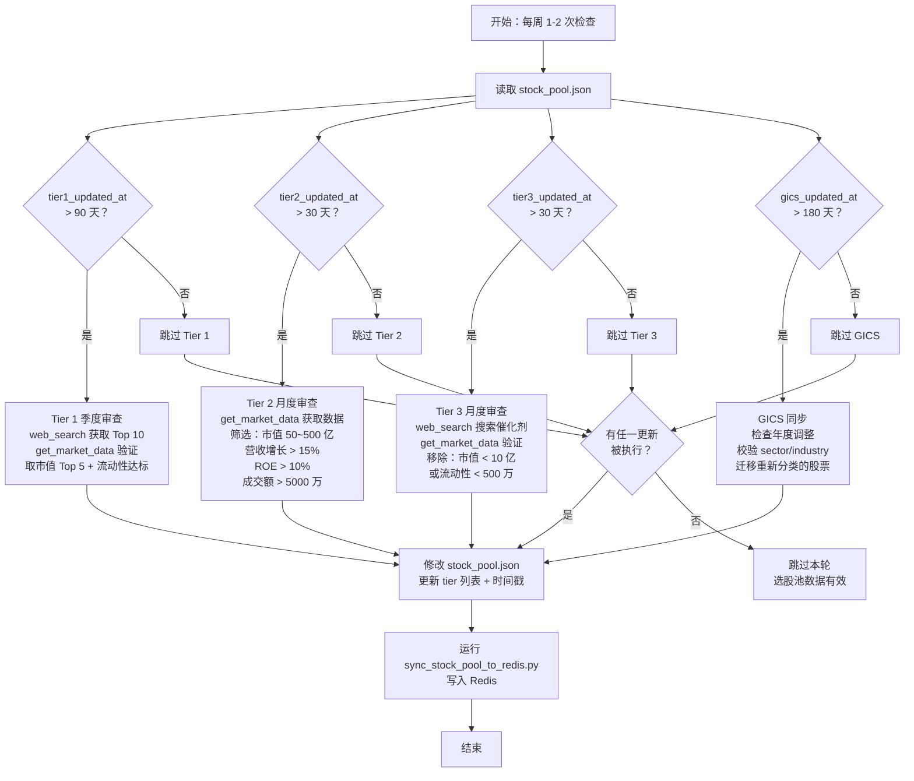

# 美股选股池管理

> 本文档定义选股池的构建、维护和使用规则。
> 选股池是**固定维护的候选宇宙**，不是每日重新生成的买卖清单。
> 配合 [美股板块轮动调仓.md](美股板块轮动调仓.md) 使用。

---

## 目录

1. [流程图](#流程图)
2. [选股池总览](#1-选股池总览)
3. [缓存驱动的工作流程](#2-缓存驱动的工作流程)
4. [个股→子板块映射](#3-个股子板块映射)
5. [三层选股池结构](#4-三层选股池结构)
6. [各子板块选股池明细](#5-各子板块选股池明细)
7. [池子维护流程](#6-池子维护流程)
8. [池子质量监控](#7-池子质量监控)
9. [常见问题](#8-常见问题)

---

## 流程图



---

## 1. 选股池总览

### 1.1 规模

| 指标 | 数值 |
|------|------|
| 子板块数量 | 29 个（GICS Level 2） |
| 每子板块候选股 | 15-25 只 |
| 总候选股规模 | 约 500-800 只 |
| Tier 1 龙头股 | 约 150 只（29 × 3-5） |
| Tier 2 中盘成长 | 约 200 只（29 × 5-10） |
| Tier 3 潜力小盘 | 约 250 只（29 × 5-15） |

### 1.2 选股池 vs 持仓

```
选股池（候选宇宙）         持仓（实际持有）
   500-800 只      →       20-50 只
   固定维护                动态调整
   月度刷新                每日跟踪
```

选股池是"可以买什么"，持仓是"已经买了什么"。两者通过轮动调仓流程连接。

### 1.3 核心原则

1. **池子是固定的，评分是动态的** — 池子里的股票相对稳定，变化的是评分排名
2. **定期刷新，不是推倒重来** — 每次刷新只增删少量股票（通常 < 10%）
3. **Tier 1 稳定，Tier 3 灵活** — 龙头股季度审查，小盘股月度更新

---

## 2. 缓存驱动的工作流程

### 2.1 数据存储

选股池数据存储在 `scripts/stock_pool.json`（数据源），通过 `sync_stock_pool_to_redis.py` 同步到 Redis 公用 key `/vnpy:美股:板块选股池`（永不过期）。JSON 结构包含分层时间戳，各层级独立记录最后更新时间：

```json
{
  "meta": {
    "tier1_updated_at": "2026-06-28",
    "tier2_updated_at": "2026-06-28",
    "tier3_updated_at": "2026-06-28",
    "gics_updated_at": "2026-03-15",
    "previous_snapshot": {
      "saved_at": "2026-06-21",
      "tier_counts": {"T1": 150, "T2": 200, "T3": 250},
      "tier1_tickers": ["NVDA","AMD",...],
      "tier2_tickers": ["MRVL","MCHP",...],
      "tier3_tickers": [...]
    }
  },
  "sub_sectors": {
    "45301020": {
      "name": "半导体与半导体设备",
      "sector": "信息技术",
      "gics_hierarchy": {
        "sector": "信息技术",
        "industry_group": "科技硬件与设备",
        "industry": "半导体与半导体设备",
        "sub_industry": "半导体"
      },
      "tiers": { ... }
    }
  }
}
```

> **previous_snapshot**：每次更新时保存上一版的 ticker 列表摘要，用于计算换手率和稳定性指标。

> **为什么分层**：Tier 1 季度审查（90 天）、Tier 2/3 月度审查（30 天），
> 单一 `updated_at` 会导致 Tier 1 的季度审查永远无法触发（被月度更新覆盖）。

### 2.2 读取与时效判断

```
Step 1: 从 stock_pool.json 读取选股池数据
  → 直接读取 scripts/stock_pool.json（数据源文件）
  → 解析 JSON，检查各层级独立时间戳
  - 如果文件存在 → 解析 JSON，获取各子板块候选股列表
  - 如果文件不存在 → 提示"选股池未初始化，请先运行同步脚本"

Step 2: 根据各层级时间戳独立判断是否需要触发研究更新
  - meta.tier1_updated_at > 90 天 → 触发 Tier 1 审查
  - meta.tier2_updated_at > 30 天 → 触发 Tier 2 审查
  - meta.tier3_updated_at > 30 天 → 触发 Tier 3 审查
  - meta.gics_updated_at > 180 天 → 触发 GICS 同步
```

### 2.3 更新触发规则

| 层级 | 检查频率 | 触发条件 | 操作 |
|------|---------|---------|------|
| **Tier 1 龙头股** | 每季度 | `tier1_updated_at` 距今天数 > 90 天 | 触发全面审查，更新 Tier 1 列表 |
| **Tier 2 中盘成长** | 每月 | `tier2_updated_at` 距今天数 > 30 天 | 触发中盘股审查，更新 Tier 2 列表 |
| **Tier 3 潜力小盘** | 每月 | `tier3_updated_at` 距今天数 > 30 天 | 触发小盘股研究，更新 Tier 3 列表 |
| **GICS 映射** | 每半年 | `gics_updated_at` 距今天数 > 180 天 | 同步 GICS 分类变更 |

### 2.4 更新执行流程

> **执行频率**：每周 1-2 次检查缓存，按需触发更新（不是每天检查）。

```
────────────────────────────────────────────────────────
IF 需要更新 Tier 1（tier1_updated_at > 90 天）:

  1. 对每个子板块，用 web_search 获取当前 Top 10 龙头股列表：
     web_search: "{子板块名称} largest stocks by market cap {当前年份}"

  2. 用 get_market_data.py 验证获取到的候选股数据：
     python scripts/get_market_data.py --market us_stocks --tickers <候选1>,<候选2>,... --output json
     → 检查 market_cap、avg_volume、price、sector、industry

  3. 筛选条件：
     - 按 market_cap 降序排列，取 Top 5
     - 检查 avg_volume × price > 5 亿美元（流动性达标）
     - 校验 sector/industry 是否与子板块匹配（GICS 一致性检查）

  4. 更新 Tier 1 列表
  5. 更新 meta.tier1_updated_at

────────────────────────────────────────────────────────
IF 需要更新 Tier 2（tier2_updated_at > 30 天）:

  1. 获取当前 Tier 2 候选股数据（按子板块分批，每批 5-10 只）：
     python scripts/get_market_data.py --market us_stocks --tickers <子板块T2列表> --output json

  2. 筛选条件（纯数值，可自动执行）：
     - market_cap 5e9 ~ 5e10（50 亿 ~ 500 亿美元）
     - revenue_growth > 0.15（> 15%），若为 None → 参考降级策略（见下方）
     - roe > 0.10（> 10%），若为 None → 参考降级策略
     - avg_volume × price > 5e7（日均成交额 > 5000 万美元）

  3. 更新 Tier 2 列表

────────────────────────────────────────────────────────
IF 需要更新 Tier 3（tier3_updated_at > 30 天）:

  1. 搜索有明确催化剂的新标的（AI 结合 web_search + product-all-info 判断）
  2. 获取候选小盘股数据验证：
     python scripts/get_market_data.py --market us_stocks --tickers <候选列表> --output json

  3. 移除条件（纯数值，可自动执行）：
     - avg_volume × price 连续 < 5e6（500 万美元）
     - market_cap < 1e9（10 亿美元）
     - 基本面恶化（综合 revenue_growth、roe、新闻判断）

  4. 更新 Tier 3 列表（增删不超过 20%）
  5. 更新 meta.tier3_updated_at

────────────────────────────────────────────────────────
字段降级策略（revenue_growth / roe 为 None 时）：

  IF revenue_growth is None:
    → 用 product-all-info 获取最新新闻，查找"营收增长/收入增长/revenue growth"
    → 用 web_search 查找 "{ticker} latest quarterly revenue growth"
    → 仍无法判断 → 标记 "⚠️ 待人工确认"，暂时保留在池中

  IF roe is None:
    → 用 web_search 查找 "{ticker} ROE return on equity latest"
    → 仍无法判断 → 标记 "⚠️ 待人工确认"，暂时保留在池中

────────────────────────────────────────────────────────
更新完成后，运行同步脚本写入 Redis：
  E:\veighna_studio_43\python.exe skills/tiger-stock-strategy-analysis/scripts/sync_stock_pool_to_redis.py

> **数据源**：选股池数据存储在 `scripts/stock_pool.json`，AI 直接修改该 JSON 文件即可更新选股池，无需修改 Python 代码。

### 2.5 AI 修改 stock_pool.json 的逻辑

AI 按 2.4 流程审查后，直接编辑 `stock_pool.json` 完成更新，不需要碰 Python 代码：

```
Step 1: 读取 stock_pool.json
  → 获取当前 meta 时间戳、sub_sectors 列表

Step 2: 按 2.4 流程判断需要更新的层级
  → tier1_updated_at > 90 天 → 更新 Tier 1
  → tier2_updated_at > 30 天 → 更新 Tier 2
  → tier3_updated_at > 30 天 → 更新 Tier 3

Step 3: 执行对应层级的审查流程（2.4 节）
  → web_search 搜索候选股
  → get_market_data.py 验证数据
  → 按筛选条件确定最终列表

Step 4: 修改 stock_pool.json 中的字段
  ├─ sub_sectors → {GICS代码} → tiers → T1/T2/T3 列表
  ├─ meta → tier1_updated_at / tier2_updated_at / tier3_updated_at
  └─ meta → previous_snapshot（保存旧版摘要用于计算换手率）

Step 5: 运行同步脚本写入 Redis
  → E:\veighna_studio_43\python.exe ...sync_stock_pool_to_redis.py
```

> **注意**：AI 只修改 `stock_pool.json` 中的以下字段：
> - `sub_sectors.*.tiers.T1/T2/T3` — ticker 列表
> - `meta.tier1_updated_at / tier2_updated_at / tier3_updated_at` — 时间戳
> - `meta.previous_snapshot` — 旧版摘要
>
> 其他字段（`gics_hierarchy`、`name`、`sector`、`version`、`description` 等）除非 GICS 年度调整，否则不动。
```

### 2.5 读取命令示例

```bash
# ── 读取选股池数据（直接读取 stock_pool.json 数据源）──
# 直接查看 scripts/stock_pool.json 文件内容
# JSON 路径:
#   meta.tier1_updated_at → 判断 Tier 1 是否需要更新（> 90 天触发）
#   meta.tier2_updated_at → 判断 Tier 2 是否需要更新（> 30 天触发）
#   meta.tier3_updated_at → 判断 Tier 3 是否需要更新（> 30 天触发）
#   meta.gics_updated_at  → 判断 GICS 是否需要同步（> 180 天触发）
#   meta.previous_snapshot → 上一版 ticker 列表，用于计算换手率

# ── 获取板块 ETF 实时数据 ──
python scripts/get_market_data.py --market us_stocks --batch us-sectors --output json
# 返回：11 个板块 ETF 的价格、涨跌幅、均线、52周分位

# ── 获取指定个股数据（用于验证候选股）──
python scripts/get_market_data.py --market us_stocks --tickers NVDA,AMD,INTC,MU,QCOM --output json
# 返回字段：
#   price, volume, avg_volume(20日均量), ma_20/50/200, pct_52w(52周分位)
#   market_cap(市值), pe_ratio, pb_ratio, roe, revenue_growth
#   sector(板块), industry(行业)
# 筛选示例：
#   market_cap 50e9~500e9 → Tier 2 中盘
#   revenue_growth > 0.15 → 营收增长 > 15%
#   roe > 0.10 → ROE > 10%

# ── 获取单品种深度分析（新闻+评级+技术指标）──
python scripts/get_market_data.py --fetch-url product-all-info --ticker AAPL --output json
# 返回：近 7 天新闻、机构评级共识、ATR/CCI/支撑压力位

# ── 获取全量美股数据（索引+宏观+板块+风格+龙头）──
python scripts/get_market_data.py --market us_stocks --batch us-all --output json
# 返回：约 40 个品种的完整市场快照

# ── 获取全局经济日历（非农/CPI/FOMC等）──
python scripts/get_market_data.py --fetch-url calendar --output json

# ── 获取 14 项市场指标（替代 web_search）──
python scripts/get_market_data.py --fetch-url web-indicators --output json
# 返回：HY OAS、MOVE、Fear & Greed、Margin Debt 等
```

---

## 3. 个股→子板块映射

### 3.1 映射方式（按优先级）

```
方式一：GICS 官方分类（最准确）
  - 数据源：Bloomberg、FactSet、MSCI 的 GICS 分类接口
  - 每个股票有唯一的 GICS 代码（8 位数字，如 45301020 = 半导体）
  - 每季度更新一次（GICS 年度调整在 3 月/9 月）

方式二：ETF 成分股反推（次优）
  - 子板块 ETF（如 SMH）的成分股 = 该子板块的核心股票
  - 适用于有独立 ETF 的子板块

方式三：行业关键词匹配（兜底）
  - 通过公司财报中的 SIC/NAICS 代码或业务描述匹配
  - 精度较低，仅作为补充
```

### 3.2 映射维护

```
- 初始建池：通过 Bloomberg/FactSet 接口批量获取 GICS 代码
- 季度同步：GICS 年度调整后（3 月/9 月），更新映射表
- 异常处理：若个股 GICS 代码变更，自动迁移到新子板块
- 手动修正：对于明显分类错误的个股（如 TSLA 曾被归入消费可选），手动复核
```

### 3.3 常见映射示例

每个子板块在 JSON 中同时保留 GICS 代码和完整中文层级，AI 可直接利用语义信息：

```json
{
  "gics_code": "45301020",
  "gics_hierarchy": {
    "sector": "信息技术",
    "industry_group": "科技硬件与设备",
    "industry": "半导体与半导体设备",
    "sub_industry": "半导体"
  }
}
```

| 股票 | GICS 代码 | 板块 | 行业组 | 行业 |
|------|-----------|------|--------|------|
| NVDA | 45301020 | 信息技术 | 科技硬件与设备 | 半导体与半导体设备 |
| AMD | 45301020 | 信息技术 | 科技硬件与设备 | 半导体与半导体设备 |
| JPM | 40101010 | 金融 | 银行 | 银行 |
| MSFT | 45103020 | 信息技术 | 软件与服务 | 软件与服务 |
| AMZN | 25504040 | 消费可选 | 零售业 | 互联网与直销零售 |
| JNJ | 35202010 | 医疗保健 | 制药、生物科技与生命科学 | 制药 |
| XOM | 10102010 | 能源 | 能源 | 石油、天然气与消费燃料 |

---

## 4. 三层选股池结构

### 4.1 三层定义

```
┌─────────────────────────────────────────────────────┐
│              子板块选股池（示例：半导体）               │
├─────────────────────────────────────────────────────┤
│  Tier 1：龙头股（3-5 只）                            │
│  web_search 筛选子板块市值 Top 5 + 流动性验证          │
│  → NVDA, AMD, INTC, MU, QCOM                        │
├─────────────────────────────────────────────────────┤
│  Tier 2：中盘成长股（5-10 只）                       │
│  market_cap 5e9~5e10 + revenue_growth>15% + roe>10% │
│  → MRVL, MCHP, STM, NXPI, ON                        │
├─────────────────────────────────────────────────────┤
│  Tier 3：潜力小盘股（5-15 只）                       │
│  市值 < 50 亿，高成长，高波动，高风险                 │
│  → 根据季度财报和催化剂动态更新                       │
└─────────────────────────────────────────────────────┘
```

### 4.2 各层级选股标准

| 维度 | Tier 1 龙头股 | Tier 2 中盘成长 | Tier 3 潜力小盘 |
|------|--------------|----------------|----------------|
| **市值** | AI web_search 获取子板块 Top 10，取 Top 5 | 50 亿 ~ 500 亿（→ `market_cap`） | < 50 亿（→ `market_cap`） |
| **日均成交额** | > 5 亿美元（→ `avg_volume × price`） | > 5000 万美元（→ `avg_volume × price`） | > 500 万美元（→ `avg_volume × price`） |
| **机构持仓** | > 60%（暂不可自动获取，AI 结合已知信息判断） | > 30%（暂不可自动获取） | 不限 |
| **营收增长** | 不限 | > 15%（→ `revenue_growth`，None 时见降级策略） | > 20% 或拐点 |
| **ROE** | > 10%（→ `roe`） | > 10%（→ `roe`，None 时见降级策略） | 不限（关注趋势） |
| **数量** | 3-5 只 | 5-10 只 | 5-15 只 |
| **刷新频率** | 季度（90 天） | 月度（30 天） | 月度（30 天） |
| **判定方式** | web_search + get_market_data 验证 | 纯数值，可自动 | 纯数值 + AI 辅助搜索 |

### 4.3 各层级操作策略

| 层级 | 定位 | 操作策略 |
|------|------|---------|
| **Tier 1 龙头股** | 板块风向标，流动性最好 | 作为板块配置的主要工具，加仓/减仓首选 |
| **Tier 2 中盘成长** | 超额收益来源，弹性好 | 板块强势时优先加仓，获取超额收益 |
| **Tier 3 潜力小盘** | 高赔率品种，高风险 | 仅占总仓位 5% 以内，单只不超过 1% |

### 4.4 层级间流动

```
个股可以在层级间流动（但不会跨子板块）：

Tier 2 → Tier 1：季度审查时 AI 判断是否晋升（market_cap 排名前例 + 流动性达标）
Tier 3 → Tier 2：market_cap > 5e10（500 亿），且 revenue_growth > 0.15
Tier 1 → Tier 2：季度审查时 market_cap 显著低于同子板块其他 Tier 1，或流动性持续下降
Tier 2 → Tier 3：market_cap < 3e9（30 亿），或基本面恶化

层级调整在刷新时执行，不实时调整。
```

---

## 5. 各子板块选股池明细

### 5.1 信息技术

#### 半导体与半导体设备（45301020）

| 层级 | 股票 | 市值 | 日均成交额 | 备注 |
|------|------|------|-----------|------|
| T1 | NVDA | 巨盘 | > 100 亿 | AI 芯片龙头 |
| T1 | AMD | 巨盘 | > 30 亿 | CPU/GPU |
| T1 | INTC | 大盘 | > 10 亿 | 晶圆代工转型 |
| T1 | MU | 大盘 | > 10 亿 | 存储芯片 |
| T1 | QCOM | 大盘 | > 10 亿 | 移动芯片 |
| T2 | MRVL | 中盘 | > 2 亿 | 数据中心网络芯片 |
| T2 | MCHP | 中盘 | > 1 亿 | MCU |
| T2 | STM | 中盘 | > 1 亿 | 汽车芯片 |
| T2 | NXPI | 中盘 | > 1 亿 | 汽车/物联网芯片 |
| T2 | ON | 中盘 | > 1 亿 | 功率半导体 |
| T3 | 动态更新 | 小盘 | > 500 万 | 每月审查 |

#### 软件与服务（45103020）

| 层级 | 股票 | 市值 | 日均成交额 | 备注 |
|------|------|------|-----------|------|
| T1 | MSFT | 巨盘 | > 50 亿 | 云/AI 平台 |
| T1 | ORCL | 巨盘 | > 10 亿 | 数据库/云 |
| T1 | CRM | 大盘 | > 5 亿 | CRM/SaaS |
| T1 | ADBE | 大盘 | > 5 亿 | 创意软件 |
| T1 | NOW | 大盘 | > 5 亿 | IT 服务管理 |
| T2 | PANW | 大盘 | > 3 亿 | 网络安全 |
| T2 | CRWD | 中盘 | > 2 亿 | 端点安全 |
| T2 | DDOG | 中盘 | > 1 亿 | 可观测性 |
| T2 | MDB | 中盘 | > 1 亿 | 数据库 |
| T3 | 动态更新 | 小盘 | > 500 万 | 每月审查 |

#### 技术硬件与设备（45201020）

| 层级 | 股票 | 市值 | 日均成交额 | 备注 |
|------|------|------|-----------|------|
| T1 | AAPL | 巨盘 | > 50 亿 | 消费电子 |
| T1 | DELL | 大盘 | > 5 亿 | 服务器/PC |
| T1 | HPQ | 大盘 | > 2 亿 | PC/打印 |
| T1 | HPE | 中盘 | > 1 亿 | 企业硬件 |
| T2 | STX | 中盘 | > 1 亿 | 存储设备 |
| T2 | WDC | 中盘 | > 1 亿 | 存储设备 |
| T2 | JBL | 中盘 | > 5000 万 | 电子制造服务 |
| T3 | 动态更新 | 小盘 | > 500 万 | 每月审查 |

### 5.2 金融

#### 银行 - 大型银行（40101010）

| 层级 | 股票 | 市值 | 日均成交额 | 备注 |
|------|------|------|-----------|------|
| T1 | JPM | 巨盘 | > 10 亿 | 全能银行龙头 |
| T1 | BAC | 巨盘 | > 5 亿 | 零售银行 |
| T1 | WFC | 巨盘 | > 5 亿 | 零售银行 |
| T1 | C | 大盘 | > 3 亿 | 全球银行 |
| T2 | GS | 大盘 | > 3 亿 | 投行 |
| T2 | MS | 大盘 | > 3 亿 | 投行/财富管理 |

#### 银行 - 地区银行（40101015）

| 层级 | 股票 | 市值 | 日均成交额 | 备注 |
|------|------|------|-----------|------|
| T1 | KEY | 中盘 | > 5000 万 | 中西部 |
| T1 | FITB | 中盘 | > 5000 万 | 中西部 |
| T1 | TFC | 大盘 | > 1 亿 | 东南部 |
| T2 | HBAN | 中盘 | > 3000 万 | 中西部 |
| T2 | RF | 中盘 | > 3000 万 | 东南部 |
| T3 | 动态更新 | 小盘 | > 500 万 | 每月审查 |

#### 综合金融（40201010）

| 层级 | 股票 | 市值 | 日均成交额 | 备注 |
|------|------|------|-----------|------|
| T1 | BRK.B | 巨盘 | > 5 亿 | 多元化金融 |
| T1 | BX | 大盘 | > 3 亿 | 私募股权 |
| T1 | BLK | 大盘 | > 2 亿 | 资管龙头 |
| T2 | KKR | 大盘 | > 1 亿 | 私募股权 |
| T2 | APO | 中盘 | > 1 亿 | 另类资管 |
| T3 | 动态更新 | 小盘 | > 500 万 | 每月审查 |

#### 保险（40301010）

| 层级 | 股票 | 市值 | 日均成交额 | 备注 |
|------|------|------|-----------|------|
| T1 | MET | 大盘 | > 1 亿 | 人寿保险 |
| T1 | PRU | 大盘 | > 1 亿 | 人寿保险 |
| T1 | AIG | 大盘 | > 1 亿 | 财产保险 |
| T2 | ALL | 大盘 | > 5000 万 | 财产保险 |
| T2 | TRV | 大盘 | > 5000 万 | 财产保险 |
| T3 | 动态更新 | 小盘 | > 500 万 | 每月审查 |

### 5.3 医疗保健

#### 制药、生物科技与生命科学（35202010）

| 层级 | 股票 | 市值 | 日均成交额 | 备注 |
|------|------|------|-----------|------|
| T1 | JNJ | 巨盘 | > 5 亿 | 综合药企 |
| T1 | PFE | 巨盘 | > 5 亿 | 综合药企 |
| T1 | MRK | 巨盘 | > 5 亿 | 综合药企 |
| T1 | ABBV | 巨盘 | > 5 亿 | 免疫/肿瘤 |
| T1 | AMGN | 大盘 | > 3 亿 | 生物科技 |
| T2 | GILD | 大盘 | > 2 亿 | 抗病毒 |
| T2 | BIIB | 中盘 | > 1 亿 | 神经科学 |
| T2 | VRTX | 大盘 | > 2 亿 | 基因治疗 |
| T2 | REGN | 大盘 | > 1 亿 | 眼科/免疫 |
| T3 | 动态更新 | 小盘 | > 500 万 | 每月审查 |

#### 医疗设备与服务（35101010）

| 层级 | 股票 | 市值 | 日均成交额 | 备注 |
|------|------|------|-----------|------|
| T1 | UNH | 巨盘 | > 5 亿 | 健康险 |
| T1 | MDT | 大盘 | > 3 亿 | 医疗设备 |
| T1 | ABT | 巨盘 | > 3 亿 | 综合医疗 |
| T1 | BSX | 大盘 | > 2 亿 | 心血管设备 |
| T2 | ISRG | 大盘 | > 2 亿 | 手术机器人 |
| T2 | EW | 中盘 | > 1 亿 | 心脏瓣膜 |
| T2 | DXCM | 中盘 | > 1 亿 | 血糖监测 |
| T3 | 动态更新 | 小盘 | > 500 万 | 每月审查 |

### 5.4 消费可选

#### 零售业 - 电商（25504040）

| 层级 | 股票 | 市值 | 日均成交额 | 备注 |
|------|------|------|-----------|------|
| T1 | AMZN | 巨盘 | > 50 亿 | 电商/云龙头 |
| T1 | SHOP | 大盘 | > 3 亿 | 电商 SaaS |
| T2 | ETSY | 中盘 | > 5000 万 | 手工电商 |
| T2 | WISH | 小盘 | > 1000 万 | 折扣电商 |
| T3 | 动态更新 | 小盘 | > 500 万 | 每月审查 |

#### 零售业 - 实体零售（25504030）

| 层级 | 股票 | 市值 | 日均成交额 | 备注 |
|------|------|------|-----------|------|
| T1 | WMT | 巨盘 | > 5 亿 | 折扣零售 |
| T1 | COST | 巨盘 | > 5 亿 | 会员制仓储 |
| T1 | TGT | 大盘 | > 2 亿 | 百货零售 |
| T2 | DG | 大盘 | > 1 亿 | 折扣店 |
| T2 | DLTR | 中盘 | > 5000 万 | 折扣店 |
| T3 | 动态更新 | 小盘 | > 500 万 | 每月审查 |

#### 汽车与零部件（25101010）

| 层级 | 股票 | 市值 | 日均成交额 | 备注 |
|------|------|------|-----------|------|
| T1 | TSLA | 巨盘 | > 50 亿 | 电动车龙头 |
| T1 | GM | 大盘 | > 2 亿 | 传统车企 |
| T1 | F | 大盘 | > 2 亿 | 传统车企 |
| T2 | RIVN | 中盘 | > 1 亿 | 电动车 |
| T2 | LCID | 小盘 | > 3000 万 | 豪华电动车 |
| T3 | 动态更新 | 小盘 | > 500 万 | 每月审查 |

#### 耐用消费品与服装（25201010）

| 层级 | 股票 | 市值 | 日均成交额 | 备注 |
|------|------|------|-----------|------|
| T1 | NKE | 巨盘 | > 5 亿 | 运动服饰 |
| T1 | LULU | 大盘 | > 2 亿 | 运动服饰 |
| T2 | DECK | 中盘 | > 5000 万 | 鞋类 |
| T2 | RL | 中盘 | > 3000 万 | 奢侈品 |
| T3 | 动态更新 | 小盘 | > 500 万 | 每月审查 |

#### 消费者服务（25301010）

| 层级 | 股票 | 市值 | 日均成交额 | 备注 |
|------|------|------|-----------|------|
| T1 | MCD | 巨盘 | > 3 亿 | 快餐 |
| T1 | SBUX | 大盘 | > 3 亿 | 咖啡 |
| T1 | BKNG | 巨盘 | > 3 亿 | 在线旅游 |
| T2 | DRI | 中盘 | > 5000 万 | 餐饮 |
| T2 | YUM | 大盘 | > 5000 万 | 快餐 |
| T3 | 动态更新 | 小盘 | > 500 万 | 每月审查 |

### 5.5 消费必需

#### 食品、饮料与烟草（30201010）

| 层级 | 股票 | 市值 | 日均成交额 | 备注 |
|------|------|------|-----------|------|
| T1 | KO | 巨盘 | > 5 亿 | 饮料 |
| T1 | PEP | 巨盘 | > 5 亿 | 食品/饮料 |
| T2 | KHC | 大盘 | > 1 亿 | 包装食品 |
| T2 | MDLZ | 大盘 | > 1 亿 | 零食 |
| T3 | 动态更新 | 小盘 | > 500 万 | 每月审查 |

#### 食品与必需品零售（30101010）

| 层级 | 股票 | 市值 | 日均成交额 | 备注 |
|------|------|------|-----------|------|
| T2 | KR | 大盘 | > 1 亿 | 超市 |
| T2 | SYY | 大盘 | > 5000 万 | 食品分销 |
| T3 | 动态更新 | 小盘 | > 500 万 | 每月审查 |

#### 家用品与个人用品（30301010）

| 层级 | 股票 | 市值 | 日均成交额 | 备注 |
|------|------|------|-----------|------|
| T1 | PG | 巨盘 | > 5 亿 | 家用品 |
| T1 | CL | 大盘 | > 1 亿 | 个人护理 |
| T1 | EL | 大盘 | > 1 亿 | 化妆品 |
| T2 | CHD | 中盘 | > 5000 万 | 家用品 |
| T2 | CLX | 中盘 | > 5000 万 | 清洁用品 |
| T3 | 动态更新 | 小盘 | > 500 万 | 每月审查 |

### 5.6 能源

#### 石油、天然气与消费燃料（10102010）

| 层级 | 股票 | 市值 | 日均成交额 | 备注 |
|------|------|------|-----------|------|
| T1 | XOM | 巨盘 | > 10 亿 | 综合能源 |
| T1 | CVX | 巨盘 | > 10 亿 | 综合能源 |
| T1 | COP | 大盘 | > 3 亿 | 上游 |
| T2 | EOG | 大盘 | > 2 亿 | 上游 |
| T2 | OXY | 大盘 | > 2 亿 | 上游 |
| T2 | SLB | 大盘 | > 2 亿 | 油服 |
| T3 | 动态更新 | 小盘 | > 500 万 | 每月审查 |

#### 能源设备与服务（10101010）

| 层级 | 股票 | 市值 | 日均成交额 | 备注 |
|------|------|------|-----------|------|
| T1 | HAL | 大盘 | > 1 亿 | 油服 |
| T2 | BKR | 大盘 | > 1 亿 | 设备 |
| T2 | NOV | 中盘 | > 5000 万 | 设备 |
| T3 | 动态更新 | 小盘 | > 500 万 | 每月审查 |

### 5.7 工业

#### 资本品（20101010）

| 层级 | 股票 | 市值 | 日均成交额 | 备注 |
|------|------|------|-----------|------|
| T1 | CAT | 巨盘 | > 3 亿 | 工程机械 |
| T1 | GE | 巨盘 | > 5 亿 | 综合工业 |
| T1 | HON | 巨盘 | > 3 亿 | 多元化工业 |
| T1 | RTX | 巨盘 | > 2 亿 | 航空航天 |
| T2 | DE | 大盘 | > 2 亿 | 农业机械 |
| T2 | CARR | 大盘 | > 1 亿 | 暖通空调 |
| T2 | EMR | 大盘 | > 1 亿 | 自动化 |
| T3 | 动态更新 | 小盘 | > 500 万 | 每月审查 |

#### 运输（20301010）

| 层级 | 股票 | 市值 | 日均成交额 | 备注 |
|------|------|------|-----------|------|
| T1 | UPS | 巨盘 | > 3 亿 | 物流 |
| T1 | FDX | 大盘 | > 2 亿 | 物流 |
| T1 | CSX | 大盘 | > 1 亿 | 铁路 |
| T2 | NSC | 大盘 | > 1 亿 | 铁路 |
| T2 | UNP | 大盘 | > 1 亿 | 铁路 |
| T3 | 动态更新 | 小盘 | > 500 万 | 每月审查 |

#### 商业与服务用品（20201010）

| 层级 | 股票 | 市值 | 日均成交额 | 备注 |
|------|------|------|-----------|------|
| T1 | WM | 巨盘 | > 2 亿 | 废物管理 |
| T1 | RSG | 大盘 | > 1 亿 | 废物管理 |
| T2 | GPN | 大盘 | > 1 亿 | 支付处理 |
| T2 | EFX | 中盘 | > 5000 万 | 信用报告 |
| T3 | 动态更新 | 小盘 | > 500 万 | 每月审查 |

### 5.8 材料

#### 化学制品（15101010）

| 层级 | 股票 | 市值 | 日均成交额 | 备注 |
|------|------|------|-----------|------|
| T1 | LIN | 巨盘 | > 2 亿 | 工业气体 |
| T1 | SHW | 大盘 | > 1 亿 | 涂料 |
| T1 | DD | 大盘 | > 1 亿 | 特种化学品 |
| T2 | APD | 大盘 | > 1 亿 | 工业气体 |
| T2 | EC | 中盘 | > 5000 万 | 特种化学品 |
| T3 | 动态更新 | 小盘 | > 500 万 | 每月审查 |

#### 金属与采矿（15104010）

| 层级 | 股票 | 市值 | 日均成交额 | 备注 |
|------|------|------|-----------|------|
| T1 | BHP | 巨盘 | > 2 亿 | 多元化矿业 |
| T1 | RIO | 巨盘 | > 1 亿 | 多元化矿业 |
| T1 | NEM | 大盘 | > 1 亿 | 黄金 |
| T2 | FCX | 大盘 | > 1 亿 | 铜 |
| T2 | SCCO | 中盘 | > 5000 万 | 铜 |
| T3 | 动态更新 | 小盘 | > 500 万 | 每月审查 |

#### 建筑材料（15102010）

| 层级 | 股票 | 市值 | 日均成交额 | 备注 |
|------|------|------|-----------|------|
| T1 | CRH | 大盘 | > 5000 万 | 建材 |
| T1 | MLM | 中盘 | > 5000 万 | 建材 |
| T2 | VMC | 中盘 | > 3000 万 | 骨料 |
| T2 | EXP | 小盘 | > 1000 万 | 建材 |
| T3 | 动态更新 | 小盘 | > 500 万 | 每月审查 |

#### 容器与包装（15103010）

| 层级 | 股票 | 市值 | 日均成交额 | 备注 |
|------|------|------|-----------|------|
| T1 | WRK | 中盘 | > 3000 万 | 纸包装 |
| T1 | IP | 大盘 | > 5000 万 | 纸包装 |
| T2 | BALL | 中盘 | > 3000 万 | 金属包装 |
| T2 | SEE | 中盘 | > 2000 万 | 保护包装 |
| T3 | 动态更新 | 小盘 | > 500 万 | 每月审查 |

#### 纸与林木产品（15105010）

| 层级 | 股票 | 市值 | 日均成交额 | 备注 |
|------|------|------|-----------|------|
| T1 | WY | 中盘 | > 3000 万 | 林产品 |
| T2 | PCH | 小盘 | > 1000 万 | 林产品 |
| T3 | 动态更新 | 小盘 | > 500 万 | 每月审查 |

### 5.9 公用事业

#### 公用事业（55101010）

| 层级 | 股票 | 市值 | 日均成交额 | 备注 |
|------|------|------|-----------|------|
| T1 | NEE | 巨盘 | > 3 亿 | 电力/新能源 |
| T1 | DUK | 大盘 | > 1 亿 | 电力 |
| T1 | SO | 大盘 | > 1 亿 | 电力 |
| T2 | AEP | 大盘 | > 5000 万 | 电力 |
| T2 | EXC | 大盘 | > 5000 万 | 电力 |
| T2 | XEL | 大盘 | > 5000 万 | 电力 |
| T3 | 动态更新 | 小盘 | > 500 万 | 每月审查 |

### 5.10 房地产

#### 房地产（60101010）

| 层级 | 股票 | 市值 | 日均成交额 | 备注 |
|------|------|------|-----------|------|
| T1 | PLD | 大盘 | > 2 亿 | 工业物流 REIT |
| T1 | AMT | 大盘 | > 2 亿 | 通信铁塔 REIT |
| T1 | EQIX | 大盘 | > 1 亿 | 数据中心 REIT |
| T2 | O | 大盘 | > 1 亿 | 零售 REIT |
| T2 | SPG | 大盘 | > 1 亿 | 商场 REIT |
| T2 | WELL | 大盘 | > 1 亿 | 医疗 REIT |
| T3 | 动态更新 | 小盘 | > 500 万 | 每月审查 |

### 5.11 通信服务

#### 媒体与娱乐（50201010）

| 层级 | 股票 | 市值 | 日均成交额 | 备注 |
|------|------|------|-----------|------|
| T1 | META | 巨盘 | > 30 亿 | 社交媒体 |
| T1 | GOOGL | 巨盘 | > 30 亿 | 搜索/视频 |
| T1 | NFLX | 巨盘 | > 5 亿 | 流媒体 |
| T1 | DIS | 巨盘 | > 5 亿 | 综合媒体 |
| T2 | SNAP | 中盘 | > 1 亿 | 社交媒体 |
| T2 | PINS | 中盘 | > 5000 万 | 图片社交 |
| T2 | ROKU | 中盘 | > 5000 万 | 流媒体平台 |
| T3 | 动态更新 | 小盘 | > 500 万 | 每月审查 |

#### 电信服务（50101010）

| 层级 | 股票 | 市值 | 日均成交额 | 备注 |
|------|------|------|-----------|------|
| T1 | T | 巨盘 | > 3 亿 | 电信 |
| T1 | VZ | 巨盘 | > 3 亿 | 电信 |
| T1 | TMUS | 巨盘 | > 2 亿 | 电信 |
| T2 | LUMN | 小盘 | > 2000 万 | 企业通信 |
| T3 | 动态更新 | 小盘 | > 500 万 | 每月审查 |

---

## 6. 池子维护流程

### 6.1 周度检查流程

> **执行频率**：每周 1-2 次（非每天）。

```
每次执行时，先按 2.2 流程读取缓存，再按以下流程检查：

Step 1: 检查时间戳是否需要触发更新
  - tier1_updated_at > 90 天 → 触发 Tier 1 季度审查 → 执行 2.4 Tier 1 流程
  - tier2_updated_at > 30 天 → 触发 Tier 2 月度审查 → 执行 2.4 Tier 2 流程
  - tier3_updated_at > 30 天 → 触发 Tier 3 月度审查 → 执行 2.4 Tier 3 流程
  - 都不需要更新 → 跳过本轮，"选股池数据有效，无需更新"

Step 2: 按子板块分批获取数据（不是全量一次性获取）
  # 每批 5-10 只，子板块为单位独立调用
  python scripts/get_market_data.py --market us_stocks --tickers <子板块候选股列表> --output json

Step 3: 检查 Tier 流动（仅纯数值判断，无 "Top N" 依赖）
  - Tier 3 → Tier 2：market_cap > 5e10 且 revenue_growth > 0.15
  - Tier 2 → Tier 3：market_cap < 3e9 或基本面恶化
  - Tier 1 ↔ Tier 2：仅季度审查时 AI 综合判断

Step 4: 更新 Tier 3 小盘股
  - 移除：market_cap < 1e9、avg_volume × price < 5e6、基本面恶化
  - 新增：有明确催化剂的新标的（web_search 搜索）
  - 每次增删不超过 Tier 3 总数的 20%

Step 5: 修改 stock_pool.json + sync 写回 Redis
  - 编辑 scripts/stock_pool.json 中的对应字段
  - 更新对应 meta.{tier}_updated_at
  - 运行 E:\veighna_studio_43\python.exe skills/tiger-stock-strategy-analysis/scripts/sync_stock_pool_to_redis.py
```

### 6.2 季度审查流程

> 仅当 `tier1_updated_at > 90 天` 时触发，与 GICS 年度调整同步。

```
Step 1: 同步 GICS 分类更新
  - 检查 GICS 年度调整（3 月/9 月）
  - 对每个 ticker，用 get_market_data.py 返回的 sector/industry 字段校验分类
  - 处理被重新分类的股票

Step 2: 全面审查 Tier 1 龙头股（参见 2.4 Tier 1 更新流程）
  - 对每个子板块，web_search 获取 Top 10 候选
  - 用 get_market_data.py 验证 market_cap、流动性、GICS 归属
  - 确认每个子板块的 Top 5 列表

Step 3: 审查选股标准
  - 评估当前数值阈值是否合理（如 500 亿/50 亿门槛）
  - 根据市场环境调整阈值
```

### 6.3 增删标准

#### 新增股票条件

```
满足以下任一条件即可纳入选股池：

1. market_cap > 5e10（500 亿，Tier 1 候选）
2. market_cap 5e9 ~ 5e10 且 revenue_growth > 0.20（Tier 2 候选）
3. 有明确催化剂且 market_cap > 5e8（5 亿，Tier 3 候选）
4. IPO 满 6 个月且 avg_volume × price > 1e7（1000 万美元）
```

#### 移除股票条件

```
满足以下任一条件即从选股池移除：

1. market_cap < 3e10（300 亿，Tier 1）
2. market_cap < 5e8（5 亿，Tier 3）
3. avg_volume × price 连续 < 5e6（500 万美元）
4. 被收购/退市/破产
5. GICS 分类变更到其他子板块（用 get_market_data.py 返回的 sector/industry 校验）
```

---

## 7. 池子质量监控

### 7.1 监控指标

| 指标 | 目标值 | 监控频率 | 说明 |
|------|-------|---------|------|
| 子板块覆盖率 | 100% | 每次检查 | 29 个子板块是否都有候选股 |
| 流动性覆盖率 | > 90% | 每次检查 | 候选股 avg_volume × price > 5e6 的比例 |
| 池子换手率 | < 10%/月 | 月度 | 对比 meta.previous_snapshot 计算增删比例 |
| Tier 1 稳定性 | > 95% | 季度 | 对比 meta.previous_snapshot 的 tier1_tickers |
| 评分区分度 | > 0.3 | 月度 | Top 20% 与 Bottom 20% 的评分差距 |

### 7.2 异常处理

```
发现问题 → 记录日志 → 触发审查 → 修正池子

常见异常：
- 子板块覆盖率 < 100%：补充候选股或标记为"低覆盖子板块"
- 流动性覆盖率 < 90%：移除 avg_volume × price 不足的 Tier 3 股票
- 池子换手率 > 20%：检查是否刷新过于激进
```

---

## 8. 常见问题

### Q1: 每次评分得出的个股不一样，怎么办？

**A**: 这是正常的。池子是固定的，评分是动态的。评分变化反映市场变化，但**操作频率由双周期机制控制**——评分变化只记录，不直接触发交易，只有到了再平衡节点才按最新评分执行。

### Q2: 池子里的股票会不会过时？

**A**: 月度刷新机制确保池子及时更新。Tier 1 龙头股非常稳定（季度审查），Tier 3 小盘股每月更新。每次刷新只增删 < 10% 的股票，不会推倒重来。

### Q3: 如何保证池子的客观性？

**A**: 选股标准是量化的（市值、流动性、基本面），不是主观挑选。任何满足标准的股票都可以进入池子。Tier 1 龙头股由市值排名自动确定，不需要人工判断。

### Q4: 个股 GICS 分类变了怎么办？

**A**: 季度审查时同步 GICS 更新，自动将股票迁移到新的子板块。如果迁移导致某个子板块候选股不足，触发补充流程。

### Q5: 选股池和持仓是什么关系？

**A**: 选股池是"可以买什么"（候选宇宙），持仓是"已经买了什么"（实际持有）。两者通过轮动调仓流程连接——调仓时从选股池中按评分排序选出操作对象。

---

> **版本**: v2.1
> **更新日期**: 2026-06-29
> **关联文档**: [美股板块轮动调仓.md](美股板块轮动调仓.md)
