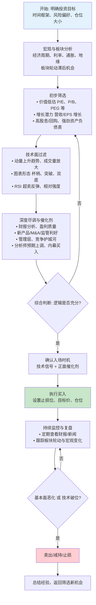

# 美股做多选择 — 提前发现的选股逻辑

> **核心目标**：在价值低估或板块轮动滞后的标的中，提前发现上涨驱动逻辑，结合技术面确认入场时机。

---

## 一、投资目标与风格定义

在开始选股前，先明确自身定位：

| 维度 | 选项 |
|------|------|
| 时间框架 | 短期（1-4周）/ 中期（1-6个月）/ 长期（6个月+） |
| 风格偏向 | 价值型 / 成长型 / 动量型 / 股息型 |
| 风险偏好 | 保守 / 中等 / 激进 |
| 单票仓位 | X% 单票上限，Y% 板块集中度上限 |

> **提前发现的本质**：在市场尚未充分定价前，基于基本面、资金面、板块轮动的逻辑推断，提前布局。

---

## 二、宏观与板块分析

### 2.1 宏观环境判断

| 因子 | 关注指标 | 对做多的影响 |
|------|----------|-------------|
| 利率周期 | 美联储利率、10Y-2Y利差 | 降息周期利好成长/高估值，加息周期利好价值/防御 |
| 通胀趋势 | CPI、PCE、核心CPI | 通胀回落支持降息预期 |
| 经济周期 | GDP、PMI、非农就业 | 扩张期买周期股，衰退期买防御/必需品 |
| 地缘风险 | 战争、制裁、选举 | 避险情绪压制整体估值 |
| 流动性 | 美联储资产负债表、逆回购规模 | 流动性宽松支持风险资产 |

### 2.2 板块轮动滞后机会（重点）

板块轮动通常存在**滞后补涨**规律：

1. **早期阶段**（经济复苏初期）：金融、工业、材料率先启动
2. **中期阶段**（扩张期）：科技、非必需消费、通信服务跟上
3. **后期阶段**（过热/滞涨）：能源、医疗、公用事业补涨
4. **衰退阶段**：防御性板块（公用事业、医疗、必需消费）相对强势

> **操作思路**：当第一梯队板块已经大幅上涨后，寻找同一逻辑下尚未大幅上涨的第二梯队板块或个股。

### 2.3 板块轮动预测（新增）

在选股前，先判断资金下一个可能流入的板块，提前布局而非追涨。

#### 预测逻辑

板块轮动不是随机的，有清晰的传导链条可追踪：

```text
宏观环境变化（利率/通胀/经济数据）
    ↓
资金从当前主线板块流出或溢出
    ↓
流入下一个受益板块（滞后补涨 / 对冲逻辑 / 超跌反弹）
    ↓
板块 ETF 相对强弱变化
    ↓
板块内个股跟涨（龙头先动 → 卫星股补涨）
```

#### 常见轮动模式

| 当前状态 | 可能轮入的板块 | 逻辑 |
|---------|---------------|------|
| AI/科技大涨后高位滞涨 | 半导体/软件/金融 | 资金溢出到同一大逻辑下的二线 |
| 利率预期下行 | 成长股/科技/房地产 | 利率敏感板块率先反弹 |
| 经济衰退担忧 | 医疗/必需消费/公用事业 | 防御性板块资金流入 |
| 经济复苏确认 | 金融/工业/材料 | 周期板块启动 |
| 能源大涨后 | 工业/材料/运输 | 成本传导链 |
| 主线板块过热（20日超额>8%） | 同一逻辑下的二线板块 | 资金溢出效应 |

#### 判断依据

AI 综合以下维度判断：

1. **板块相对强弱** — 各板块 ETF 的 20 日收益率排名，找出排名上升最快但尚未领涨的板块
2. **轮动阶段** — 大盘分析缓存的轮动阶段（晚期 → 找防御；早期 → 找跟涨）
3. **宏观匹配** — 当前宏观环境最利好的板块方向
4. **成交量异动** — 板块 ETF 成交量放大但价格未涨 = 资金悄悄吸筹
5. **超跌反弹** — 板块 20 日跑输 SPY > 5% 但基本面未恶化

#### 预测结果的使用

预测结果直接影响候选池方向：

| 置信度 | 候选池分配 |
|-------|-----------|
| 高 | 预测板块 70% + 当前主线 30% |
| 中 | 预测板块 50% + 当前主线 50% |
| 低 | 以当前主线为主，预测板块仅作补充 |

> **注意**：板块轮动预测是概率判断，不是确定性预测。AI 必须如实标注置信度，列出反向信号。

---

## 三、初步筛选（从宽到窄）

### 3.1 价值低估信号

| 指标 | 筛选标准 | 备注 |
|------|----------|------|
| P/E（静态/动态） | 低于行业中位数或自身历史均值 | 需结合增长看，不能单看低估 |
| P/B | < 1.5 或低于同业 | 适用于金融、周期股 |
| PEG | < 1.0 | 成长性合理低估 |
| EV/EBITDA | < 行业中位数 | 排除会计操纵影响 |
| 自由现金流收益率 | > 4-5% | 真金白银回报股东 |

### 3.2 增长潜力信号

| 指标 | 筛选标准 |
|------|----------|
| 营收增速（YoY） | > 10-15%（连续2-3季度） |
| EPS 增速（YoY） | > 15% 或同比增速加快 |
| 毛利率/净利率趋势 | 持续改善或稳定在高位 |
| 研发投入占比（科技股） | 高于同业，且产出可追踪 |

### 3.3 股东回报信号

| 指标 | 说明 |
|------|------|
| 股息率 | 2-5%，且有持续增长历史 |
| 回购计划 | 大额授权回购，减少流通股 |
| 管理层增持 | 内部人士（CEO/CFO）公开市场买入 |

### 3.4 资产负债表稳健信号

- 流动比率 > 1.5
- 净债务/EBITDA < 2x（或净现金状态）
- 利息覆盖倍数 > 5x
- 速动比率 > 1.0

---

## 四、技术面过滤

### 4.1 趋势形态确认

| 信号 | 含义 |
|------|------|
| 200日均线向上倾斜 | 长期趋势是多头 |
| 50日线上穿200日线（金叉） | 中期趋势转多 |
| 价格站稳20/50日均线上方 | 短期趋势健康 |
| 周线 MACD 零轴上方金叉 | 中级行情启动 |

### 4.2 经典看涨形态

- **杯柄形态**（Cup & Handle）：杯形回调 + 缩量柄部 → 放量突破柄部高点
- **双底/三底**：两次/三次探底不破前低，放量上穿颈线
- **旗形/三角旗形**：强势上涨后的缩量整理 → 放量突破上轨
- **W底突破**：两次探底形成 W 形态，右底高于左底更强势
- **箱体突破**：长期横盘后放量突破箱体上沿

### 4.3 动量与超卖信号

| 指标 | 使用方式 |
|------|----------|
| RSI(14) | < 30 超卖区域关注；> 70 超买谨慎；底背离（价格新低、RSI未新低）为看涨信号 |
| 成交量 | 上涨放量、回调缩量为健康模式；突破时必须放量 |
| 相对强度（RS） | 个股走势相对于 SPY 或同板块指数，RS 线持续向上为强势 |
| OBV（能量潮） | 价格震荡但 OBV 持续走高，说明资金在吸筹 |
| MACD | 底背离或零轴上方金叉 |

---

## 五、深度尽调与催化剂验证

### 5.1 财报质量分析

- **营收质量**：增长来自量的增长 vs 涨价 vs 并购（有机增长更优）
- **盈利质量**：经营性现金流是否匹配净利润
- **指引质量**：管理层给出的未来指引是否超预期、是否有上调趋势
- **一致性预期**：EPS 预期是否有上调趋势（大行分析师持续上调目标价）

### 5.2 催化剂类型

| 催化剂类型 | 例子 | 时间维度 |
|------------|------|---------|
| 财报催化剂 | 超预期季报 + 上调指引 | 短中期（1-4周） |
| 产品催化剂 | FDA 批准、新品发布、产品放量 | 中期（1-6个月） |
| M&A 催化剂 | 收购/被收购、资产剥离、重大合作 | 中短期 |
| 监管催化剂 | 行业监管放宽、政策利好 | 中期 |
| 宏观催化剂 | 降息、财政刺激、关税变化 | 中短期 |
| 资金催化剂 | 纳入指数、大股东增持、回购加速 | 中期 |
| 技术催化剂 | 突破关键技术、专利授权 | 长期 |

### 5.3 管理层与护城河

- 管理层过往业绩（是否有成功历史、持股比例）
- 行业护城河：品牌溢价 / 专利壁垒 / 网络效应 / 规模成本优势 / 转换成本
- 内幕交易信号：CEO/CFO 近期是否有公开市场买入（SEC Form 4）
- 机构持仓变化：知名基金（巴菲特的13F等）是否新进或加仓

### 5.4 分析师与市场情绪

- 券商研报：目标价是否上调、评级是否提升、上调家数是否超过下调
- 做空比例：高做空比例 + 基本面改善 = 潜在的轧空行情
- 媒体关注度：关注度低但有研报覆盖 → 市场尚未充分定价

---

## 六、综合判断与入场时机

### 6.1 评分卡（参考）

| 维度 | 权重 | 评分（1-5） | 加权得分 |
|------|------|------------|---------|
| 价值低估 | 20% | | |
| 增长潜力 | 25% | | |
| 技术面形态 | 20% | | |
| 催化剂强度 | 20% | | |
| 管理层/护城河 | 15% | | |
| **合计** | **100%** | | |

> 总分 > 3.5 可重点关注，> 4.0 可执行买入。

### 6.2 入场时机选择

- 等待技术面信号与基本面逻辑**共振**
- 避免在财报前重仓赌财报（除非有明确信心）
- 考虑在**缩量回调至均线支撑**时低吸，而非追高突破
- 分批建仓：先建 1/3 底仓，确认逻辑后加仓

---

## 七、仓位管理与风险控制

### 7.1 仓位规则

- 单票最大仓位上限：X%（建议 10-15%）
- 单板块集中度上限：Y%（建议 25-30%）
- 根据胜率调整仓位：高分标的 ≥ 正常仓位，低分标的 ≤ 1/2仓位

### 7.2 止损策略

| 类型 | 规则 |
|------|------|
| 硬止损 | 入场价的 5-8% 下方 |
| 移动止损 | 跟随 20日/50日均线，跌破即止损 |
| 技术止损 | 突破失败（放量跌破突破点）即止损 |
| 逻辑止损 | 基本面逻辑被证伪（财报不及预期、管理层变更等） |

### 7.3 目标价设定

- 技术目标：前高、通道上轨、阻力位
- 基本面目标：基于 DCF 估值或可比公司 P/E 估值
- 三步走：第一目标（阻力位）- 减仓1/3，第二目标（合理估值）- 减仓1/3，第三目标（溢价区域）- 视情况决定

---

## 八、持续监控与复盘

### 8.1 日常监控清单

- [ ] 持仓股的财报日历（是否有即将发布的季报）
- [ ] 行业新闻 / 板块 ETF 走势（跟踪板块轮动）
- [ ] 技术面关键位（是否跌破止损、接近目标价）
- [ ] 宏观数据发布（CPI、非农、FOMC 会议）
- [ ] 内幕交易 / 机构持仓变化
- [ ] 分析师评级更新

### 8.2 复盘模板（卖出后填写）

```
标的: ________
买入日期: ________  卖出日期: ________
持有天数: ________  收益率: ________

买入逻辑复盘:
- 哪些逻辑成立？_______________
- 哪些逻辑未兑现？_______________

卖出原因:
□ 达到目标价  □ 止损出局  □ 基本面恶化  □ 更好的机会

改进点:
- 下次在哪个环节可以做得更好？_______________
```

---

## 九、卖出纪律

出现以下任一信号，应果断卖出/减持：

1. **基本面恶化**：连续两个季度营收/EPS不及预期、管理层下调指引
2. **技术破位**：放量跌破关键支撑位（如 50日均线、突破颈线）
3. **板块轮动结束**：同板块龙头开始走弱，相对强度转负
4. **出现更好的机会**：发现更优标的，需要腾出仓位
5. **达到目标价**：按照预定计划分批止盈
6. **宏观逆转**：降息预期逆转、经济数据大幅恶化

---

## 十、完整流程图



---

## 附录：常用选股数据来源

| 数据类型 | 推荐工具/来源 |
|----------|-------------|
| 基本面数据 | Finviz、Yahoo Finance、Morningstar、SEC EDGAR |
| 技术面分析 | TradingView、Thinkorswim、IB 图表 |
| 板块轮动 | Finviz Sector Performance、Relative Rotation Graphs |
| 内幕交易 | SEC Form 4、OpenInsider |
| 机构持仓 | WhaleWisdom、SEC 13F Filings |
| 做空数据 | FINRA Short Interest、HighShortInterest.com |
| 分析师评级 | TipRanks、Zacks、MarketBeat |
| 宏观数据 | Fed Data Dashboard、FRED |

---

> **文档说明**：本文档是美股做多选股的系统流程指南，核心逻辑围绕"提前发现"——在价值低估、板块轮动滞后或催化剂尚未充分定价时提前布局。每个环节可根据个人风格调整权重。