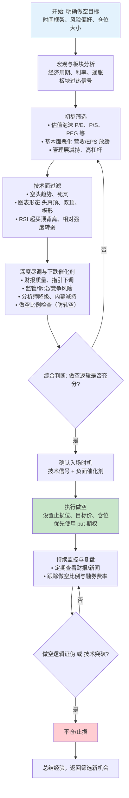

# 美股做空选择 — 提前发现的做空逻辑

> **核心目标**：在估值泡沫、基本面恶化或板块轮动过热的标的中，提前发现下跌驱动逻辑，结合技术面确认做空入场时机。
>
> **⚠️ 做空风险警示**：做空的最大亏损是无限的（股价理论上可以无限上涨），单票仓位建议不超过账户净值的 5-8%，必须设置硬止损。

---

## 一、投资目标与风格定义

在开始选股前，先明确自身定位：

| 维度 | 选项 |
|------|------|
| 时间框架 | 短期（1-4周）/ 中期（1-6个月）/ 长期（6个月+） |
| 风格偏向 | 价值陷阱型 / 泡沫破灭型 / 动量衰竭型 / 事件驱动型 |
| 风险偏好 | 保守 / 中等 / 激进 |
| 单票仓位 | X% 单票上限（建议 ≤ 5-8%），Y% 板块集中度上限 |

> **提前发现的本质**：在市场尚未充分定价负面因素前，基于基本面恶化、估值泡沫、资金流出的逻辑推断，提前布局做空。

---

## 二、宏观与板块分析

### 2.1 宏观环境判断

| 因子 | 关注指标 | 对做空的影响 |
|------|----------|-------------|
| 利率周期 | 美联储利率、10Y-2Y利差 | 加息周期利好做空高估值成长股 |
| 通胀趋势 | CPI、PCE、核心CPI | 通胀反复压制估值，利好做空 |
| 经济周期 | GDP、PMI、非农就业 | 衰退期做空周期股，过热期做空防御股 |
| 地缘风险 | 战争、制裁、选举 | 避险情绪放大跌幅 |
| 流动性 | 美联储资产负债表、逆回购规模 | 流动性收紧压制风险资产 |

### 2.2 板块轮动过热信号（做空机会）

板块轮动中，**过热板块**是潜在的做空对象：

1. **主线板块 20 日涨幅超额 > 10%** — 短期透支，回调概率增大
2. **板块 ETF 成交量异常放大但价格滞涨** — 资金出货迹象
3. **板块内龙头股出现顶背离** — 价格新高但 RSI/成交量未新高
4. **分析师共识极度乐观（> 80% 买入评级）** — 过度拥挤，反向信号
5. **板块轮动阶段 = 晚期** — 资金即将流出

> **操作思路**：当某个板块出现上述 3 条及以上信号时，寻找板块内估值最高、基本面最弱的标的做空。

### 2.3 板块轮动预测（做空视角）

在选股前，先判断哪些板块可能成为**资金流出的对象**，提前布局做空而非追跌。

#### 预测逻辑

板块资金流出有清晰的传导链条可追踪，与做多方向相反：

```text
宏观环境变化（利率上行/经济衰退/政策收紧/通胀反复）
    ↓
资金从当前主线板块或高估值板块流出
    ↓
流入防御板块或低估值板块（避险 / 估值回归）
    ↓
原板块 ETF 相对强弱走弱（跑输 SPY）
    ↓
板块内个股跟跌（龙头先跌 → 卫星股补跌）
```

#### 常见资金流出模式

| 当前状态 | 可能流出的板块 | 逻辑 |
|---------|---------------|------|
| 主线板块 20 日涨幅超额 > 10% | 该板块本身 | 短期过热，获利盘回吐 |
| 轮动阶段 = 晚期 | 当前主线板块 | 资金即将转向防御 |
| 宏观转向紧缩 | 高估值成长/科技 | 利率上行压制估值 |
| 经济衰退确认 | 周期板块（工业/材料/能源） | 需求下滑 |
| 板块 ETF 放量滞涨 | 该板块 | 资金出货 |
| 龙头股业绩不及预期 | 该板块及关联板块 | 龙头失速拖累整体 |
| 板块整体估值创历史新高（PEG > 2.0） | 该板块 | 估值无基本面支撑，回归压力大 |
| 利率预期上行（10Y 走高） | 成长股/科技/房地产 | 利率敏感板块率先承压 |

#### 判断依据

AI 综合以下维度判断下一个可能资金流出的板块：

1. **板块相对强弱** — 各板块 ETF 的 20 日收益率排名，找出排名下降最快且跑输 SPY 的板块
2. **轮动阶段** — 大盘分析缓存的轮动阶段（晚期 → 主线板块资金即将流出；衰退期 → 周期板块承压）
3. **宏观匹配** — 当前宏观环境最不利的板块方向（紧缩→高估值成长；衰退→周期股）
4. **成交量异动** — 板块 ETF 放量滞涨或放量下跌 = 资金在出货
5. **估值极端** — 板块整体估值处于历史 90 分位以上，PEG > 2.0，无基本面支撑

#### 预测结果的使用

预测结果直接影响做空候选池方向：

| 置信度 | 候选池分配 |
|-------|-----------|
| 高 | 预测流出板块 70% + 其他过热板块 30% |
| 中 | 预测流出板块 50% + 其他过热板块 50% |
| 低 | 以当前主线板块的弱势股为主，预测流出板块仅作补充 |

> **注意**：板块轮动预测是概率判断，不是确定性预测。做空尤其需要警惕轧空风险——即使板块资金流出，个别标的也可能因低做空比例被轧空。AI 必须如实标注置信度，列出反向信号，并在 `反方审查` 中专门检查轧空风险。

---

## 三、初步筛选（从宽到窄）

### 3.1 估值泡沫信号

| 指标 | 筛选标准 | 备注 |
|------|----------|------|
| P/E（动态） | 高于行业中位数 2 倍以上 | 需结合增长看，不能单看高估 |
| P/S | > 10（非科技）或 > 20（科技） | 营收无法支撑估值 |
| EV/EBITDA | > 行业中位数 2 倍 | 排除增长故事泡沫 |
| PEG | > 2.0 且 EPS 增速放缓 | 成长性无法支撑高估值 |
| 市值/FCF | > 50x（FCF 收益率 < 2%） | 没有真金白银支撑 |

### 3.2 基本面恶化信号

| 指标 | 筛选标准 |
|------|----------|
| 营收增速（YoY） | 连续 2-3 季度放缓或转负 |
| EPS 增速（YoY） | 连续 2 季度不及预期或同比下滑 |
| 毛利率/净利率趋势 | 持续收窄（成本上升或定价权丧失） |
| 管理层下调指引 | 未来季度营收/EPS 指引低于共识预期 |
| 经营性现金流恶化 | 净利润增长但现金流不匹配 |

### 3.3 股东行为负面信号

| 指标 | 说明 |
|------|------|
| 管理层大幅减持 | CEO/CFO 近 3 个月内净减持 > $5M |
| 机构减仓 | 知名基金（13F）大幅减持或清仓 |
| 大规模解禁 | 限售股即将解禁，稀释流通股 |
| 做空比例异常低 | < 2% 做空比例 + 高估值 = 无空头制约 |

### 3.4 资产负债表风险信号

- 净债务/EBITDA > 5x（高杠杆）
- 流动比率 < 1.0（短期偿债压力）
- 利息覆盖倍数 < 2x（盈利不足以覆盖利息）
- 商誉占比 > 50% 净资产（减值风险）
- 应收账款增速远超营收增速（回款困难）

---

## 四、技术面过滤

### 4.1 趋势形态确认

| 信号 | 含义 |
|------|------|
| 200日均线向下倾斜 | 长期趋势是空头 |
| 50日线下穿200日线（死叉） | 中期趋势转空 |
| 价格跌破20/50日均线 | 短期趋势走弱 |
| 周线 MACD 零轴下方死叉 | 中级下跌行情启动 |

### 4.2 经典看跌形态

- **头肩顶**（Head & Shoulders）：左肩 → 头部 → 右肩，跌破颈线确认
- **M头/双顶**：两次冲高不过前高，放量跌破颈线
- **上升楔形向下破位**：高点越来越高但斜率变缓，跌破下轨
- **下降旗形**：快速下跌后的缩量整理 → 放量跌破下轨
- **箱体下破**：长期横盘后放量跌破箱体下沿
- **岛形反转**：跳空上涨后跳空下跌，形成孤岛

### 4.3 动量与超买信号

| 指标 | 使用方式 |
|------|----------|
| RSI(14) | > 70 超买区域关注做空；顶背离（价格新高、RSI未新高）为强烈看跌信号 |
| 成交量 | 上涨缩量、下跌放量为弱势模式；跌破关键位时必须放量确认 |
| 相对强度（RS） | 个股走势相对于 SPY 或同板块指数，RS 线持续向下为弱势 |
| OBV（能量潮） | 价格震荡但 OBV 持续走低，说明资金在出货 |
| MACD | 顶背离或零轴下方死叉 |

---

## 五、深度尽调与下跌催化剂验证

### 5.1 财报质量分析（做空视角）

- **营收质量**：增长是否依赖一次性因素（涨价、并购）而非有机增长
- **盈利质量**：净利润增长是否来自非经常性收益（资产出售、税惠）
- **指引质量**：管理层是否给出模糊或低于共识的指引
- **一致性预期**：EPS 预期是否有下调趋势（大行分析师持续下调目标价）

### 5.2 下跌催化剂类型

| 催化剂类型 | 例子 | 时间维度 |
|------------|------|---------|
| 财报催化剂 | 不及预期季报 + 下调指引 | 短中期（1-4周） |
| 监管催化剂 | 反垄断调查、FDA 拒绝、行业监管收紧 | 中期（1-6个月） |
| 诉讼催化剂 | 集体诉讼、罚款、和解 | 中短期 |
| 宏观催化剂 | 加息、关税升级、经济数据恶化 | 中短期 |
| 资金催化剂 | 大股东减持、限售股解禁、评级下调 | 中期 |
| 竞争催化剂 | 市场份额流失、价格战、技术替代 | 长期 |
| 管理层催化剂 | CEO 离职、财务造假曝光 | 短期 |

### 5.3 管理层与护城河（做空视角）

- 管理层过往是否有不良记录（财务造假、过度乐观指引）
- 护城河是否在削弱（品牌贬值、技术落后、市场份额流失）
- 内幕交易信号：CEO/CFO 近期是否有大幅减持（SEC Form 4）
- 机构持仓变化：知名基金是否大幅减仓或清仓

### 5.4 分析师与市场情绪（做空视角）

- 券商研报：目标价是否下调、评级是否降级
- 做空比例：做空比例 > 15% 需警惕轧空风险
- 媒体关注度：过度正面报道但基本面恶化 = 市场尚未充分定价负面因素
- 卖方共识：> 80% 分析师评级为"买入" = 过度拥挤，反向做空信号

---

## 六、综合判断与入场时机

### 6.1 评分卡（做空版）

| 维度 | 权重 | 评分（1-5） | 加权得分 |
|------|------|------------|---------|
| 估值泡沫 | 20% | | |
| 基本面恶化 | 25% | | |
| 技术面形态 | 20% | | |
| 下跌催化剂强度 | 20% | | |
| 管理层/资金面 | 15% | | |
| **合计** | **100%** | | |

> 总分 > 3.5 可重点关注，> 4.0 可执行做空。

### 6.2 入场时机选择

- 等待技术面信号与基本面逻辑**共振**
- 避免在财报前重仓赌财报（财报miss可能已被定价）
- 考虑在**反弹至均线阻力**时入场做空，而非追跌
- 分批建仓：先建 1/3 底仓，确认逻辑后加仓
- **优先使用 put 期权**做空（亏损有限），而非直接融券做空

---

## 七、仓位管理与风险控制

### 7.1 仓位规则

- 单票最大仓位上限：X%（建议 5-8%，做空仓位应小于做多仓位）
- 单板块集中度上限：Y%（建议 15-20%）
- 根据胜率调整仓位：高分标的 ≥ 正常仓位，低分标的 ≤ 1/2仓位

### 7.2 止损策略

| 类型 | 规则 |
|------|------|
| 硬止损 | 入场价的 5-10% 上方（做空止损应比做多更宽，防止被轧空） |
| 移动止损 | 跟随 20日/50日均线，突破即止损 |
| 技术止损 | 突破失败（放量突破阻力位）即止损 |
| 逻辑止损 | 做空逻辑被证伪（财报超预期、利好政策出台等） |
| 时间止损 | 持有超过预定时间框架仍未下跌，平仓离场 |

### 7.3 目标价设定

- 技术目标：前低、通道下轨、支撑位
- 基本面目标：基于 DCF 估值或可比公司 P/E 估值
- 三步走：第一目标（支撑位）- 平仓1/3，第二目标（合理估值）- 平仓1/3，第三目标（恐慌区域）- 视情况决定

### 7.4 做空特有风险

| 风险 | 说明 | 应对 |
|------|------|------|
| 轧空风险 | 股价快速上涨迫使空头回补 | 避免做空做空比例 > 15% 的标的 |
| 无限亏损 | 股价理论上可以无限上涨 | 严格止损 + 使用 put 期权 |
| 融券成本 | 高做空比例标的融券费率可能很高 | 计算持仓成本，短期持仓为主 |
| 分红成本 | 做空需支付股息 | 避免在除息日前做空 |
| 回购风险 | 公司大额回购推高股价 | 避免做空有积极回购计划的标的 |

---

## 八、持续监控与复盘

### 8.1 日常监控清单

- [ ] 持仓股的财报日历（是否有即将发布的季报）
- [ ] 行业新闻 / 板块 ETF 走势（跟踪板块轮动）
- [ ] 技术面关键位（是否突破止损、接近目标价）
- [ ] 做空比例变化（是否快速下降 = 轧空风险）
- [ ] 内幕交易 / 机构持仓变化
- [ ] 分析师评级更新（是否有上调）
- [ ] 融券费率变化（是否上升 = 做空拥挤）

### 8.2 复盘模板（平仓后填写）

```
标的: ________
做空日期: ________  平仓日期: ________
持有天数: ________  收益率: ________

做空逻辑复盘:
- 哪些逻辑成立？_______________
- 哪些逻辑未兑现？_______________

平仓原因:
□ 达到目标价  □ 止损出局  □ 做空逻辑证伪  □ 更好的机会

改进点:
- 下次在哪个环节可以做得更好？_______________
```

---

## 九、平仓纪律

出现以下任一信号，应果断平仓/减持：

1. **做空逻辑证伪**：财报超预期、管理层上调指引、基本面改善
2. **技术突破**：放量突破关键阻力位（如 50日均线、头肩顶颈线）
3. **轧空信号**：股价连续 3 日放量上涨 > 5%，做空比例快速下降
4. **出现更好的机会**：发现更优做空标的，需要腾出仓位
5. **达到目标价**：按照预定计划分批止盈
6. **宏观逆转**：降息、财政刺激等利好政策出台

---

## 十、完整流程图



---

## 附录：常用做空数据来源

| 数据类型 | 推荐工具/来源 |
|----------|-------------|
| 做空数据 | FINRA Short Interest、HighShortInterest.com、IB 融券数据 |
| 基本面数据 | Finviz、Yahoo Finance、Morningstar、SEC EDGAR |
| 技术面分析 | TradingView、Thinkorswim、IB 图表 |
| 内幕交易 | SEC Form 4、OpenInsider |
| 机构持仓 | WhaleWisdom、SEC 13F Filings |
| 分析师评级 | TipRanks、Zacks、MarketBeat |
| 限售股解禁 | Nasdaq IPO Calendar、SEC Filings |
| 诉讼/监管 | SEC Litigation、FDA Calendar |
| 宏观数据 | Fed Data Dashboard、FRED |

---

> **文档说明**：本文档是美股做空选股的系统流程指南，核心逻辑围绕"提前发现"——在估值泡沫、基本面恶化或板块过热时提前布局做空。做空风险远大于做多，必须严格控制仓位和止损。建议优先使用 put 期权等有限亏损工具。
