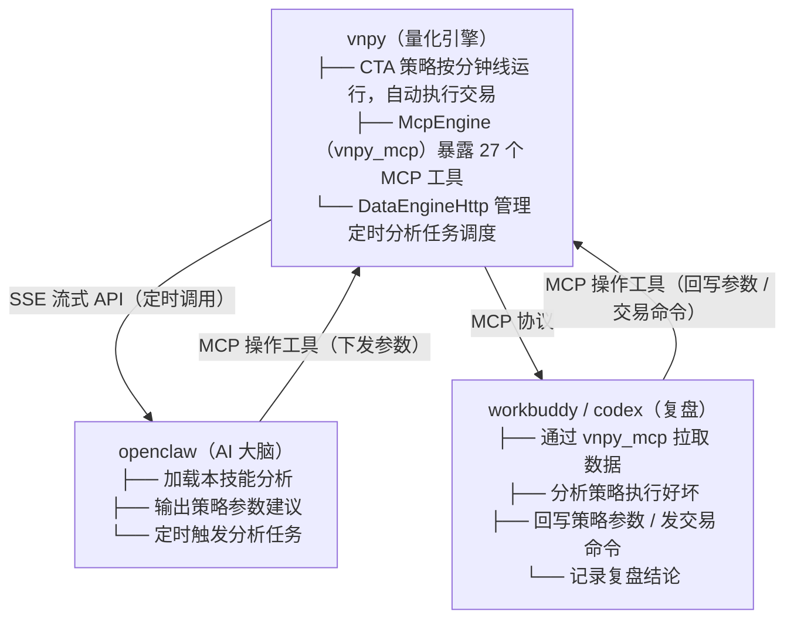

## 关于复盘

### 复盘方式

可借助 workbuddy / codex 等智能体，以本技能目录为工作目录，通过 **vnpy_mcp** 工具连接实盘运行的 vnpy 系统（vnpy 自带 openclaw，可使用本技能全自动分析和交易），定期获取复盘结果，根据实际操作的好与坏，持续改进本技能。

### 复盘记录存放

复盘工作一般情况下**不直接编辑技能文件**。复盘分析结果统一存入本技能目录下的 `复盘记录` 子文件夹，按日期创建子文件夹（格式：`YYYY-MM-DD`，如 `2026-08-04`），复盘结果存放在对应日期的文件夹中。

### 复盘结果用途

复盘结果用于改进以下三方面能力：

1. **分析能力**：大盘与板块分析、策略分析的准确性与稳定性；
2. **参数设置能力**：空仓等待 → 开仓 → 持仓 → 加减仓 → 平仓各阶段中，具体策略参数设置的准确性；
3. **干预能力**：利用 vnpy 可设置的策略参数，以及 vnpy_mcp 的参数设置与下单交易能力，干预策略运行态势的能力。

### 复盘具体任务

在 workbuddy / codex 中，按以下步骤执行：

1. 通过 **vnpy_mcp** 工具拉取账户情况和策略情况；
2. 对每个最近有交易记录的策略，逐一采用**单策略复盘分析方法**（见下方示例）；
3. 汇总所有策略的复盘结论。

示例提问：

```text
用 vnpy_mcp 工具，获取账户变化和策略情况，针对每个策略做如下分析：


获取 {策略名} 这个策略的当前状态和历史 K 线走势，并读取大盘报告与策略分析报告；根据报告时间，深入判断 vnpy 的分析报告及其交易行为是否正确，记录发现的问题和改进建议。不要修改任何数据！

对不完美或者错误的交易和分析，因为这些交易和分析使用的技能是tiger-stock-strategy-analysis，结合技能中的文档的描述，找打为什么技能会这样分析，为什么vnpy量化系统会这么操作，中间有哪些问题。

{也可以加入其他合适的分析要求}

{加入分析结果存储位置}

```

### 复盘数据铁律（2026-08-25 新增，来自 08-24 复盘教训）

1. **每次复盘必须重新拉取真实参数，不靠记忆结论。**
   - `cta_strategies_get_all` / `get_parameters_info` 逐策略实拉，止损/移动止盈/亏损加仓/网格档位一律以本次拉取为准。
   - 背景：08-24 前"移动止盈全部已批量开启"的结论系记忆错误，实拉后证实 10 个持仓策略移动止盈全部=关。
2. **成交记录必须与策略 AI 报告、持仓变化三方交叉核对。**
   - `get_trades` 只含 vnpy 本次启动后的成交，重启前成交会丢失；发现持仓股数/均价变化但 `get_trades` 无对应记录时，必须用策略 AI 报告中的持仓回顾反推成交时间线与价格，并在复盘报告中单独标注"三方核对"一节。
   - 背景：08-20/08-24 两次出现重启导致成交记录丢失（GE/AVGO/MSFT 等成交仅能通过策略报告还原）。

### 系统执行背景资料

本系统由三层组件构成闭环 AI 交易体系，任何智能体复盘时都需要先理解这个架构：

#### 组件说明

| 组件 | 是什么 | 在系统中的角色 |
|------|--------|--------------|
| **vnpy** | 定制版量化交易框架（VeighNa Studio 4.3），通过 `run.py` 启动 | 策略执行引擎：按分钟线运行 CTA 策略，自动根据参数执行开仓/加仓/平仓等交易动作 |
| **openclaw** | 部署在 vnpy 进程外的 AI 智能体（SSE 流式 API，地址 `localhost:11399`） | 分析决策大脑：加载 `tiger-stock-strategy-analysis` 技能，执行行情分析、策略判断，输出策略参数建议 |
| **tiger-stock-strategy-analysis** | 本技能（即当前目录） | openclaw 的分析依据：提供大盘分析、选股、策略审核、持仓风控的完整文档和脚本 |
| **vnpy_mcp** | vnpy 进程内启动的 MCP Server（`McpEngine`，端口 17471） | 外部接口：将 vnpy 的查询和操作能力暴露为 MCP 工具，供 openclaw 和 workbuddy/codex 调用 |

#### 闭环数据流



#### 闭环工作流

1. **定时分析**：vnpy 的 `DataEngineHttp` 按配置间隔（默认 1 小时）或 `macro_analyze.json` 时间计划，自动调用 openclaw 执行大盘分析、持仓风控等任务；
2. **AI 分析决策**：openclaw 收到请求后，加载 `tiger-stock-strategy-analysis` 技能，通过 vnpy_mcp 获取账户/持仓/策略状态/报告等数据，结合技能文档中的分析框架，输出策略参数建议；
3. **参数下发与执行**：openclaw 的分析结果通过 vnpy_mcp 的操作工具（如 `cta_strategy_set_parameters`、`cta_strategy_set_target_pos`）下发到 vnpy，vnpy 在策略参数控制下按分钟线自动执行交易；
4. **人工复盘**：workbuddy / codex 通过 vnpy_mcp 连接 vnpy，以人工对话或定时任务方式拉取账户和策略数据，对交易和分析的好坏进行复盘，记录结论到 `复盘记录` 目录。

#### 复盘的根本目的

**通过 workbuddy / codex 实现人工与 AI 协作操盘，并通过复盘持续改进 `tiger-stock-strategy-analysis` 技能**--技能改进后，openclaw 的分析质量随之提升，vnpy 的交易行为随之优化，形成正向循环。